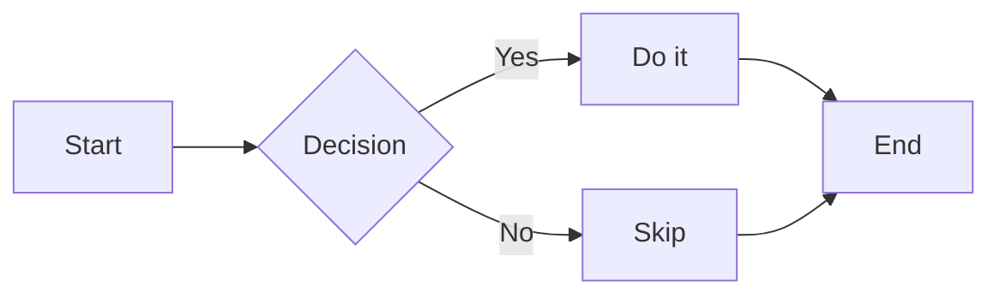
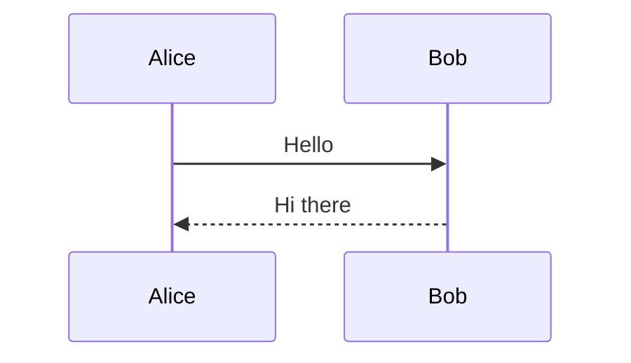

# Feat: Built-in Mermaid Diagram Support

## Goal

Render ` ```mermaid ``` ` code blocks thành diagram thật trong trình duyệt — cho cả `.md` và `.mdx` files — mà không cần cài thêm npm package nào.

---

## Context & Current State

### Những gì đã có (nhưng chưa hoàn chỉnh)

1. **`src/renderer/components.tsx`** — có `Mermaid` React component dùng cho MDX:

   ```tsx
   export function Mermaid({ children }: MermaidProps) {
     return (
       <div className="mermaid">
         <pre style={{ display: "none" }}>{children}</pre>
         <div className="mermaid-output">Loading diagram...</div>
       </div>
     );
   }
   ```

   Component này render HTML structure đúng nhưng **không bao giờ được gọi** vì không có JS chạy Mermaid.

2. **`src/renderer/markdown.ts`** — dùng `markdown-it` với `highlight.js`. Khi gặp ` ```mermaid ` nó highlight text như code bình thường, không convert sang diagram.

3. **`src/template/index.ts`** — HTML template hoàn toàn **không load Mermaid.js** từ bất kỳ đâu.

### Root cause

Thiếu duy nhất một thứ: **Mermaid.js chưa bao giờ được load vào trang**.

---

## Implementation Plan

### Thay đổi 1 — `src/renderer/markdown.ts`

Trong hàm `createMarkdownIt`, trong callback `highlight`, thêm early return cho `lang === "mermaid"`:

```ts
highlight: (str: string, lang: string): string => {
  // ADD: intercept mermaid blocks
  if (lang === "mermaid") {
    return `<div class="mermaid">${str.trim()}</div>`;
  }

  // existing hljs logic — KEEP AS IS
  if (lang && hljs.getLanguage(lang)) {
    try {
      return hljs.highlight(str, { language: lang }).value;
    } catch {
      // Fall through to plain text
    }
  }
  return md.utils.escapeHtml(str);
},
```

Làm **tương tự** cho hàm `renderMarkdownSimple` ở cuối file — nó dùng cùng pattern highlight callback, cũng cần patch giống hệt.

> **Lý do dùng `<div class="mermaid">`**: Mermaid.js tìm element có class `mermaid`, đọc text content bên trong, và replace bằng SVG rendered. Đây là cơ chế chuẩn của thư viện.

---

### Thay đổi 2 — `src/renderer/components.tsx`

Sửa lại `Mermaid` component để output đúng format mà Mermaid.js expect — text diagram nằm trực tiếp trong `<div class="mermaid">`, không dùng `<pre>` hay text phụ:

```tsx
export function Mermaid({ children }: MermaidProps) {
  return (
    <div className="mermaid" style={{ textAlign: "center", padding: "16px" }}>
      {children}
    </div>
  );
}
```

Xóa bỏ:

- `<pre style={{ display: "none" }}>` — không cần thiết
- `<div className="mermaid-output">Loading diagram...</div>` — sẽ bị replace bởi Mermaid.js

---

### Thay đổi 3 — `src/template/index.ts`

Trong hàm `renderPage`, tìm đoạn kết thúc `</body></html>` và thêm script block Mermaid **trước** `</body>`.

Vị trí chính xác trong template string — thêm vào giữa `</script>` cuối cùng và `</body>`:

```ts
  // ... existing scripts ...
  </script>

  <script type="module">
    import mermaid from 'https://cdn.jsdelivr.net/npm/mermaid@11/dist/mermaid.esm.min.mjs';
    const isDark = document.documentElement.getAttribute('data-theme') === 'dark';
    mermaid.initialize({
      startOnLoad: true,
      theme: isDark ? 'dark' : 'default',
    });
  </script>
</body>
</html>
```

> **Lý do dùng `type="module"`**: Mermaid v10+ chỉ ship dưới dạng ESM. `type="module"` cho phép dùng `import` trong browser trực tiếp mà không cần bundler.
>
> **Lý do dùng CDN**: Không cần thêm dependency vào `package.json`. Server này phục vụ local dev — có internet là đủ. Nếu muốn offline support thì cần approach khác (out of scope).

---

## Files cần sửa

| File                          | Loại thay đổi                                        |
| ----------------------------- | ---------------------------------------------------- |
| `src/renderer/markdown.ts`    | Thêm ~3 dòng trong `highlight` callback của cả 2 hàm |
| `src/renderer/components.tsx` | Sửa `Mermaid` component, bỏ ~5 dòng thừa             |
| `src/template/index.ts`       | Thêm `<script type="module">` block trước `</body>`  |

Không sửa `package.json`. Không cài thêm package.

---

## Test Cases

Sau khi implement, tạo file `test-mermaid.md` trong docs folder với nội dung:

````md
# Mermaid Test

## Flowchart



## Sequence Diagram


````

**Expected**: Cả hai block trên phải render thành SVG diagram, không phải code text.

**Verify dark mode**: Toggle theme sang dark → diagram phải đổi sang dark theme. Lưu ý: theme chỉ được apply khi page load, không live-update khi toggle — đây là hành vi chấp nhận được cho v1.

---

## Out of Scope

- Live theme switch cho diagram (cần re-init Mermaid khi toggle — để sau)
- Offline / bundle Mermaid vào server
- Server-side pre-render Mermaid thành SVG (cần puppeteer hoặc `@mermaid-js/mermaid-isomorphic` — phức tạp hơn nhiều)
