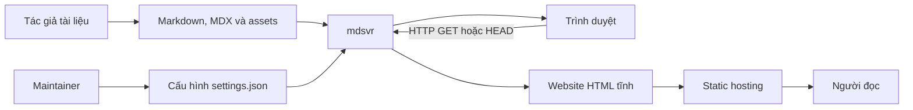

# Tổng quan hệ thống

mdsvr là ứng dụng Node.js viết bằng TypeScript, biến một cây thư mục Markdown/MDX thành website tài liệu theo hai chế độ: phục vụ động qua HTTP hoặc xuất HTML tĩnh.

## Mục tiêu kiến trúc

- Khởi chạy nhanh và hoạt động với cấu hình mặc định.
- Dùng filesystem làm nguồn nội dung duy nhất.
- Tạo HTML phía server để nội dung sẵn sàng cho SEO và static hosting.
- Giữ cùng mô hình render cho server động và static export.
- Mặc định chỉ đọc và ngăn truy cập vượt khỏi thư mục tài liệu.

## Bối cảnh hệ thống

## Các container logic

| Container | Trách nhiệm | Điểm vào |
| --- | --- | --- |
| CLI | Parse tham số, init/validate, chọn serve hoặc export | `src/cli.ts` |
| Public API | Xuất API dùng như package | `src/index.ts` |
| HTTP runtime | Khởi tạo server, cache search, reload settings | `src/server.ts` |
| Router | Chuẩn hóa URL, kiểm tra bảo mật, dispatch response | `src/router.ts` |
| Render pipeline | Chuyển Markdown/MDX thành HTML fragment và TOC | `src/renderer/` |
| Template | Ghép fragment với layout, navigation, SEO và assets | `src/template/` |
| Generators | Search index, sitemap, RSS và static export | `src/generators/` |
| Configuration | Parse, validate, default và watch settings | `src/settings/` |
| Validator | Kiểm tra và tùy chọn sửa Markdown | `src/validator/` |

## Hai chế độ thực thi

### Dynamic server

Mỗi request được ánh xạ đến file hoặc endpoint đặc biệt. Markdown/MDX được đọc và render theo request; settings và search index được giữ ở bộ nhớ cấp module.

### Static export

Toàn bộ cây nội dung được duyệt, mỗi trang được render thành `index.html` theo clean URL. Assets và metadata bổ trợ được tạo hoặc sao chép vào output.

## Ranh giới tin cậy

- **Tin cậy có điều kiện:** nội dung và settings do maintainer cung cấp.
- **Không tin cậy:** URL và request từ trình duyệt.
- **Output công khai:** HTML, assets, search index, sitemap, RSS và OG images.

MDX được compile rồi thực thi trong Node.js, vì vậy chỉ nên dùng với nội dung từ tác giả đáng tin cậy. Đây không phải sandbox cho nội dung do người dùng cuối tải lên.

## Liên quan

- [Cấu trúc module](./02-module-map.md)
- [Mô hình bảo mật](./06-security-model.md)
- [ADR-0001: Filesystem là nguồn nội dung](../02-adr/0001-filesystem-as-content-source.md)
