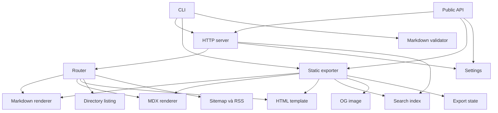

# Cấu trúc module

Codebase được tổ chức theo pipeline xử lý hơn là theo domain nghiệp vụ. CLI và public API điều phối các module thấp hơn; renderer và template không sở hữu HTTP server.

## Bản đồ dependency

## Module lõi

### `src/cli.ts`

- Parse arguments không dùng framework CLI.
- Cung cấp `--init`, `--validate`, `--validate-md`, `--export` và server mode.
- Chọn thư mục `default-docs` khi người dùng không truyền directory.
- Chuyển lỗi thành exit code cho môi trường shell/CI.

### `src/server.ts`

- Xác minh root directory.
- Load settings và build search index ban đầu.
- Tạo Node `http.Server`.
- Tự tăng port tối đa 10 lần khi port bận.
- Theo dõi settings và rebuild cache search khi cấu hình đổi.

### `src/router.ts`

- Chỉ chấp nhận `GET` và `HEAD`.
- Xử lý endpoint sinh động và file route.
- Kiểm tra path traversal cả lexical path và canonical real path.
- Chọn directory page, Markdown, MDX hoặc static file.

## Render và trình bày

| Module | Đầu vào | Đầu ra |
| --- | --- | --- |
| `renderer/markdown.ts` | Markdown và settings | HTML fragment, frontmatter, TOC |
| `renderer/mdx.ts` | MDX và settings | HTML fragment tĩnh, frontmatter, TOC |
| `renderer/components.ts` | Component props | React elements cho MDX |
| `template/index.ts` | Nội dung, settings, navigation, SEO | Tài liệu HTML hoàn chỉnh |
| `template/sidebar.ts` | Cây file và settings | Danh sách navigation |
| `directory.ts` | Directory entries | HTML directory listing |

## Generator và trạng thái

- `generators/static-export.ts`: điều phối export.
- `generators/search-index.ts`: trích dữ liệu tìm kiếm.
- `generators/sitemap.ts`: tạo sitemap XML.
- `generators/feed.ts`: tạo RSS.
- `og/`: tạo Open Graph images.
- `export-state.ts`: hash settings/source và dọn OG output không còn tham chiếu.

## Public boundary

`src/index.ts` chỉ export server API, settings API, type và static export API. Các chi tiết router, renderer và template vẫn là internal API.

## Quy tắc dependency khuyến nghị

- `settings` và type không phụ thuộc HTTP hay template.
- renderer tạo content fragment, không ghi file và không gửi response.
- template không đọc filesystem trực tiếp ngoài các helper đã được thiết kế.
- router điều phối request nhưng không chứa logic compile Markdown/MDX.
- generator có thể ghi output; dynamic server giữ hành vi chỉ đọc.

## Liên quan

- [Luồng HTTP và render](./03-request-rendering-flow)
- [Luồng static export](./04-static-export-flow)
