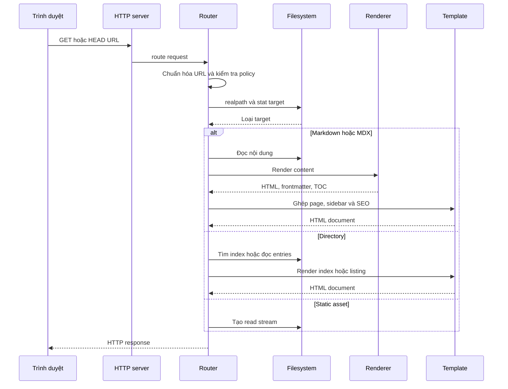
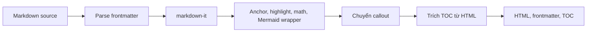
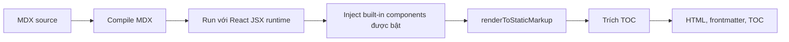

# Luồng HTTP và render

Dynamic server dùng Node.js `http` trực tiếp. Server truyền request, root directory, settings hiện tại và search index cache vào router.

## Vòng đời request

## Thứ tự route

1. Từ chối method ngoài `GET` và `HEAD`.
2. Phục vụ `/sitemap.xml`, `/feed.xml` và `/search-index.json` nếu được bật.
3. Decode URL và bỏ query string khi resolve file.
4. Kiểm tra lexical containment trong root.
5. Áp dụng hidden-file và blocked-extension policy.
6. Resolve `realpath` và kiểm tra containment lần hai để chặn symlink escape.
7. Dispatch theo directory, Markdown/MDX hoặc static extension.
8. Khi không tìm thấy, thử hậu tố `.md`, sau đó `.mdx` nếu MDX được bật.

## Directory resolution

Directory URL được canonicalize với dấu `/` cuối bằng redirect `308`. Router lần lượt:

1. thử các index file trong settings;
2. thử `index.html`;
3. tạo directory listing cho entry nhìn thấy được.

## Markdown pipeline

HTML thô được bật trong `markdown-it`; vì vậy Markdown cũng thuộc ranh giới nội dung tin cậy nếu được dùng trong môi trường nhạy cảm với XSS.

## MDX pipeline

Pipeline dùng remark GFM/frontmatter/math và rehype slug/autolink/KaTeX. Kết quả là static markup; không cần hydrate toàn bộ React app trên client.

## Error behavior

- Vi phạm policy: `403` hoặc `404` tùy trường hợp.
- Target không tồn tại: thử pretty URL rồi trả `404`.
- Lỗi route không dự kiến: ghi log server và trả `500`.
- Error page vẫn đi qua template để giữ giao diện nhất quán.

## Liên quan

- [Mô hình bảo mật](./06-security-model.md)
- [ADR-0003: Render phía server](../02-adr/0003-server-side-rendering.md)
