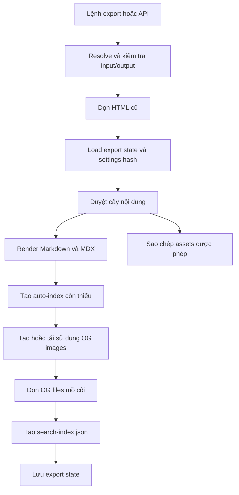

# Luồng static export

Static export tái sử dụng renderer, sidebar và template của dynamic server nhưng ghi kết quả ra filesystem để triển khai trên static hosting.

## Pipeline export

## Ánh xạ clean URL

| Source | Output | URL logic |
| --- | --- | --- |
| `README.md` | `index.html` trong cùng thư mục | `/section/` |
| `guide.md` | `guide/index.html` | `/guide` |
| `nested/page.mdx` | `nested/page/index.html` | `/nested/page` |
| Directory không có README | `index.html` tự sinh | URL directory có `/` cuối |

## Tái sử dụng render pipeline

Mỗi content file được xử lý theo cùng renderer như server động. Sau đó exporter:

1. sửa một số asset path theo URL output;
2. chuyển link `.md`/`.mdx` sang clean URL;
3. render full page với cờ `isStaticExport`;
4. ghi HTML vào output.

Điều này giảm khác biệt giao diện giữa server mode và exported mode, nhưng logic orchestration vẫn đang tồn tại riêng trong router và exporter.

## Trạng thái tăng dần

`_mdsvr/export-state.json` lưu settings hash và OG state. Hiện trạng quan trọng:

- HTML cũ được dọn và tất cả trang HTML được render lại mỗi lần export.
- Cơ chế hash tăng dần chủ yếu được sử dụng cho OG image.
- Khi settings hash thay đổi, toàn bộ OG image được buộc tạo lại.
- OG output không còn tham chiếu được dọn sau khi tạo state mới.

Vì vậy, mô tả “incremental export” nên hiểu chính xác là **incremental OG generation**, không phải incremental HTML generation hoàn chỉnh.

## Artifacts

Tùy settings, output có thể gồm:

- HTML theo clean URL;
- static assets;
- `search-index.json`;
- OG images;
- directory index tự sinh.

Sitemap và RSS có generator dùng ở dynamic routes; cần xác minh riêng khi thay đổi yêu cầu artifact của static export.

## Rủi ro đồng bộ

Router và exporter cùng thực hiện các bước chọn renderer, chọn title, build sidebar và render template. Mọi thay đổi nên có test ở cả `server.test.ts` và `static-export.test.ts` để tránh drift.

## Liên quan

- [ADR-0005: Clean URL cho static export](../02-adr/0005-clean-urls-for-static-export.md)
- [ADR-0007: Hợp nhất pipeline render](../02-adr/0007-unify-page-rendering-pipeline.md)
