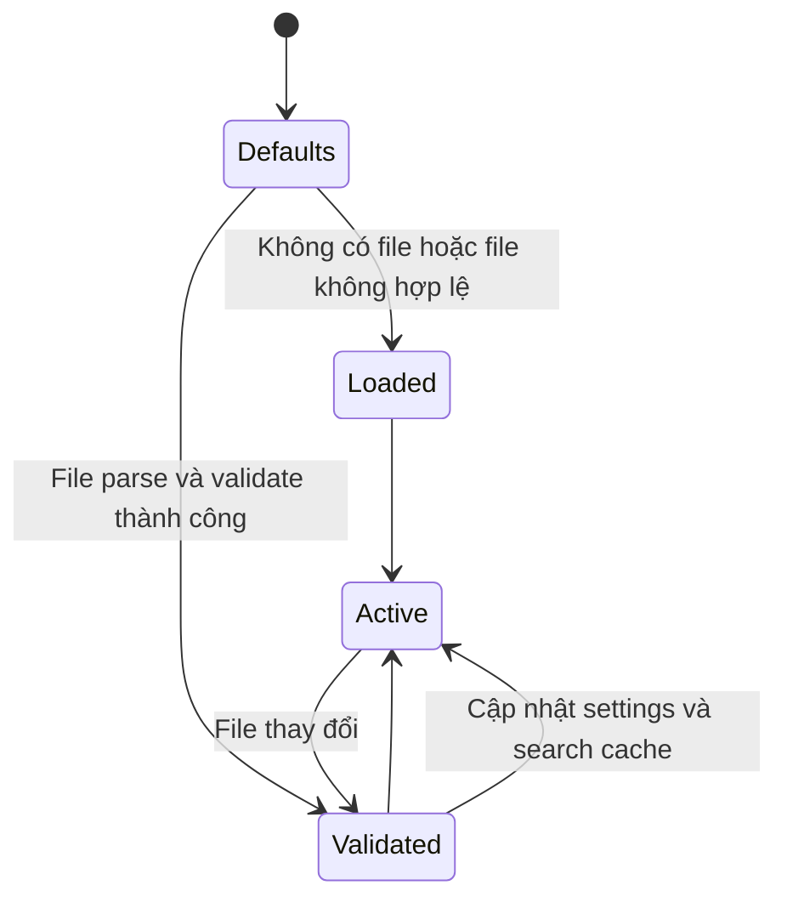

# Cấu hình và dữ liệu

mdsvr không dùng database. Dữ liệu bền vững nằm trong cây tài liệu, cấu hình JSON và artifacts do export tạo ra.

## Các nhóm dữ liệu

| Nhóm | Vị trí | Chủ sở hữu | Vòng đời |
| --- | --- | --- | --- |
| Nội dung | `*.md`, `*.mdx` | Tác giả tài liệu | Version control |
| Assets | Theo cây docs/static folders | Tác giả tài liệu | Version control |
| Settings | `_mdsvr/settings.json` | Maintainer | Tùy chọn |
| Export state | `_mdsvr/export-state.json` | mdsvr | Sinh tự động |
| Search cache | Bộ nhớ process | HTTP server | Đến khi reload/stop |
| Static output | Output directory | Exporter | Có thể tái tạo |

## Settings lifecycle

`SettingsSchema` dùng Zod vừa khai báo shape vừa cung cấp default. `loadSettings` trả defaults nếu file không tồn tại, JSON lỗi hoặc schema không hợp lệ; `validateSettingsFile` dùng cho CLI để trả lỗi chi tiết thay vì fallback im lặng.

## Hot reload

Khi `watchSettings` bật và file settings tồn tại:

1. Node `fs.watch` theo dõi file;
2. settings được load lại khi có event;
3. server thay tham chiếu settings hiện tại;
4. search index được build lại nếu search đang bật.

Nội dung Markdown không có cache trang, nên request tiếp theo đọc file mới trực tiếp.

## Trạng thái process

`currentSettings` và `searchIndexCache` hiện là biến cấp module trong `server.ts`. Thiết kế này đơn giản cho một server instance nhưng có nguy cơ chia sẻ state nếu cùng process tạo nhiều instance với các root khác nhau.

## Metadata trang

Title được chọn theo thứ tự:

1. `frontmatter.title`;
2. H1 đầu tiên;
3. tên file được humanize.

Description và SEO metadata được lấy từ frontmatter hoặc nội dung tùy code path/template. TOC được trích từ heading đã render có `id`.

## Search data

Search index được build từ content tree và trả qua `/search-index.json`. Đây là dữ liệu client-side, không phụ thuộc dịch vụ tìm kiếm ngoài.

## Nguyên tắc thay đổi schema

- Cung cấp default tương thích ngược cho field mới.
- Cập nhật schema, default generator, docs và test cùng lúc.
- Tránh đưa secret vào settings vì file có xu hướng nằm trong source control.
- Thay đổi ảnh hưởng output nên được phản ánh trong settings hash.

## Liên quan

- [ADR-0002: Cấu hình tùy chọn với Zod](../02-adr/0002-optional-zod-validated-settings.md)
- [ADR-0006: Cô lập state theo server instance](../02-adr/0006-isolate-server-instance-state.md)
