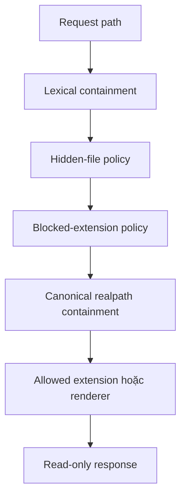

# Mô hình bảo mật

Mục tiêu bảo mật chính là ngăn HTTP client đọc file ngoài docs root hoặc đọc loại file bị cấm. Dynamic server không cung cấp endpoint ghi dữ liệu.

## Tài sản cần bảo vệ

- File ngoài thư mục tài liệu.
- File ẩn, cấu hình nội bộ và secret có extension nhạy cảm.
- Tính toàn vẹn của server process.
- Tính an toàn của HTML gửi đến người đọc.

## Ranh giới tin cậy

| Nguồn | Mức tin cậy | Lý do |
| --- | --- | --- |
| URL/request | Không tin cậy | Do client bên ngoài kiểm soát |
| Markdown có HTML thô | Tin cậy | Có thể sinh markup/script nguy hiểm |
| MDX | Tin cậy cao | Được compile và thực thi trong Node.js |
| Settings | Tin cậy | Điều khiển extensions, giao diện và feature |
| Package dependencies | Tin cậy theo supply chain | Chạy trong process và lúc build |

## Phòng vệ theo lớp

### Chống path traversal

Router dùng `path.relative` để xác minh candidate nằm trong root. Sau đó cả root và target được resolve bằng `fs.realpath` và kiểm tra lại, giúp chặn symlink trỏ ra ngoài root.

### File policy

- Tên bắt đầu bằng `_` luôn bị ẩn trong dynamic route.
- Pattern trong `settings.files.extensions.hidden` được áp dụng.
- Extension trong block list bị từ chối.
- Static file chỉ được phục vụ nếu extension nằm trong allowlist.

### HTTP surface

Chỉ `GET` và `HEAD` được chấp nhận; method khác nhận `405`. Không có upload, mutate hay delete endpoint.

## Rủi ro còn lại

### Nội dung không đáng tin cậy

`markdown-it` bật `html: true`, nên HTML thô đi vào output. MDX được thực thi bằng `@mdx-js/mdx` runtime. Không nên phục vụ nội dung do người dùng không tin cậy cung cấp nếu chưa thêm sandbox/sanitization phù hợp.

### Cấu hình policy

Maintainer có thể mở rộng serve extensions hoặc static folders. Thay đổi settings có thể làm tăng bề mặt dữ liệu công khai.

### Headers

Router hiện tập trung vào `Content-Type`; các header như CSP, `X-Content-Type-Options` và frame policy chưa được mô tả như contract bắt buộc.

## Checklist khi thay đổi router

- Test path `..`, encoded traversal và symlink escape.
- Test hidden file và blocked extension.
- Không dựa riêng vào string prefix để kiểm tra containment.
- Giữ dynamic HTTP path chỉ đọc.
- Đánh giá XSS/RCE khi thêm cú pháp hoặc component render mới.

## Liên quan

- [ADR-0004: Kiểm soát truy cập filesystem nhiều lớp](../02-adr/0004-layered-filesystem-access-control)
- [ADR-0008: Chính sách nội dung tin cậy](../02-adr/0008-trusted-content-policy)
