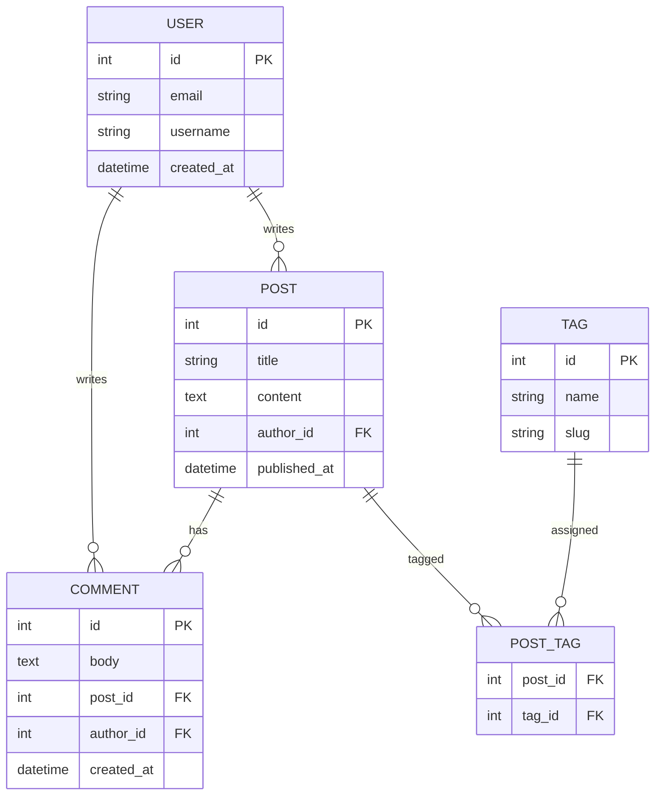

# Markdown Formats

This page demonstrates all supported Markdown formats.

## Headings

# Heading 1

## Heading 2

### Heading 3

#### Heading 4

##### Heading 5

###### Heading 6

## Text Formatting

**Bold text** using `**text**`

_Italic text_ using `*text*`

**_Bold and italic_** using `***text***`

~~Strikethrough~~ using `~~text~~`

`Inline code` using backticks

## Links

[External link](https://example.com)

[Link with title](https://example.com "Example Site")

[Relative link](/2.-settings)

## Images


## Lists

### Unordered Lists

- Item 1
- Item 2
  - Nested item 2.1
  - Nested item 2.2
- Item 3

### Ordered Lists

1. First item
2. Second item
   1. Nested item 2.1
   2. Nested item 2.2
3. Third item

### Task Lists

- [x] Completed task
- [ ] Incomplete task
- [ ] Another incomplete task

## Code Blocks

### JavaScript

```javascript
function greet(name) {
  console.log(`Hello, ${name}!`);
}
greet("World");
```

### Python

```python
def greet(name):
    print(f"Hello, {name}!")

greet("World")
```

### Shell

```bash
npm install
npm run dev
```

### Without syntax highlighting

```
Plain code block
without language
```

## Blockquotes

> This is a blockquote.
>
> It can span multiple lines.
>
> > Nested blockquote
>
> Back to first level

## Horizontal Rules

---

---

---

## Tables

| Name | Age | Occupation |
| ---- | --- | ---------- |
| John | 30  | Engineer   |
| Jane | 25  | Designer   |
| Bob  | 35  | Manager    |

### Table with alignment

| Left | Center | Right |
| :--- | :----: | ----: |
| L1   |   C1   |    R1 |
| L2   |   C2   |    R2 |

## HTML

You can use <strong>inline HTML</strong> within Markdown.

<div style="background: #f0f0f0; padding: 10px;">
  This is a div with inline styles.
</div>

## Escaping Characters

Use backslash to escape special characters: \*not italic\*, \`not code\`

## Line Breaks

Line break with two spaces at the end.  
New line starts here.

Or use double line break for new paragraph.

## Emojis

:smile: :heart: :star: (if GFM is enabled)

## Automatic Links

<https://example.com>

<user@example.com>

## Definition Lists (if supported)

Term 1
: Definition 1

Term 2
: Definition 2a
: Definition 2b

## Footnotes (if supported)

This is a reference[^1].

[^1]: This is the footnote content.

## Admonitions (if supported via custom syntax)

> **Note:** This is a note block.

> **Warning:** This is a warning block.

> **Tip:** This is a tip block.

## Mermaid Diagrams

mdsvr supports Mermaid diagrams via the `mermaid` code block:

### Database Schema Diagram


