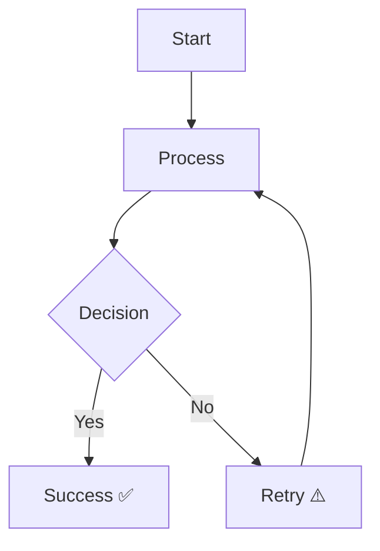
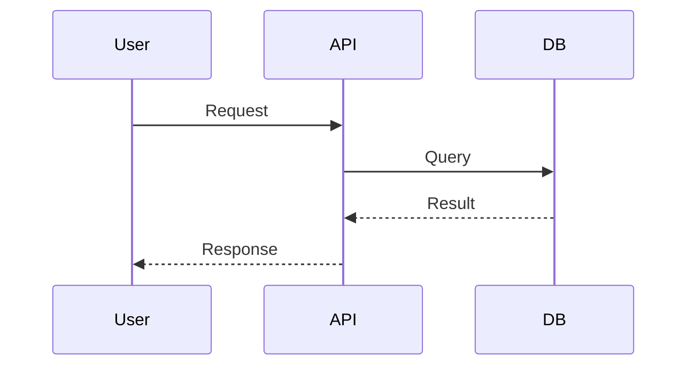
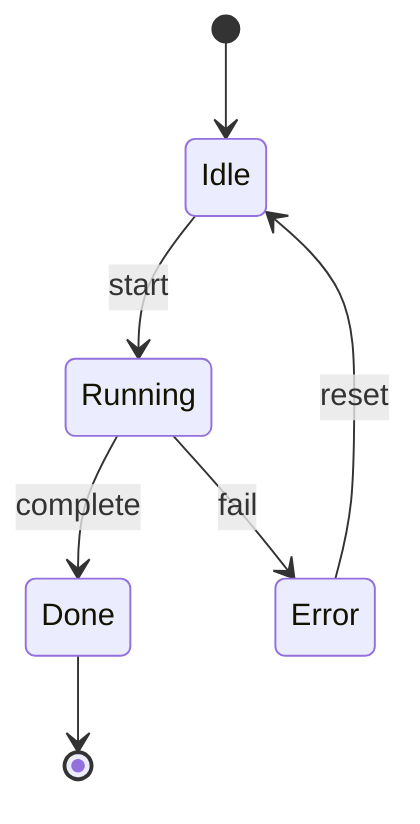
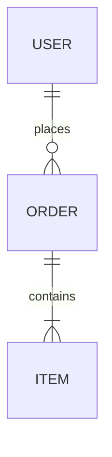
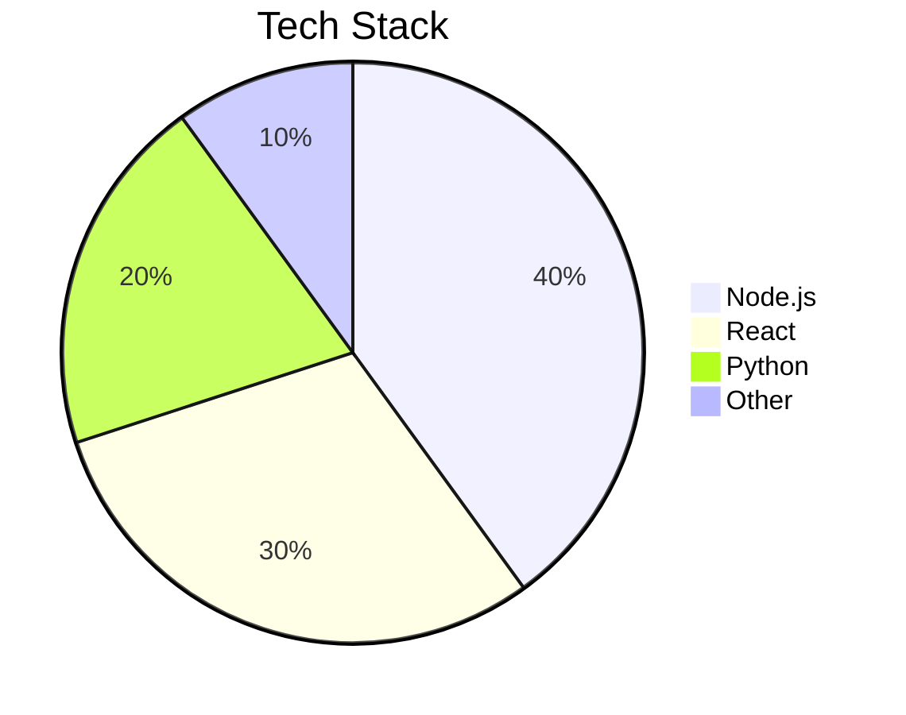
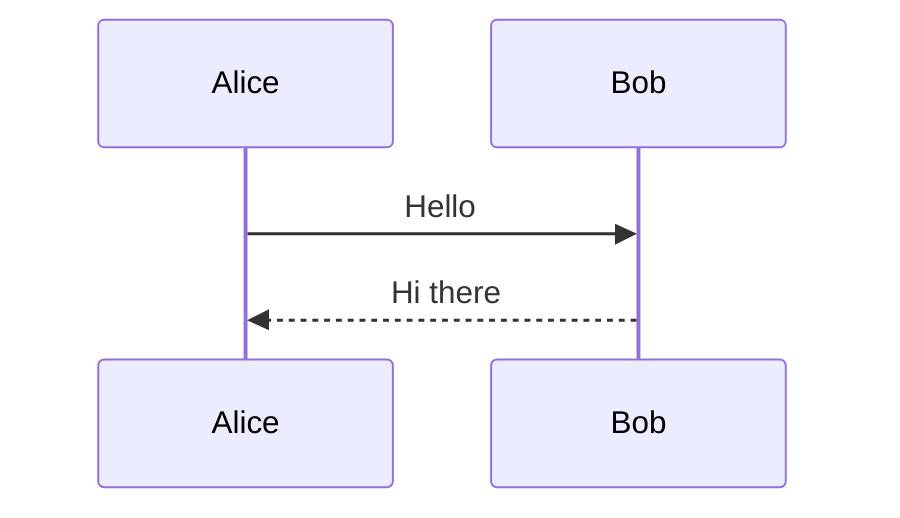
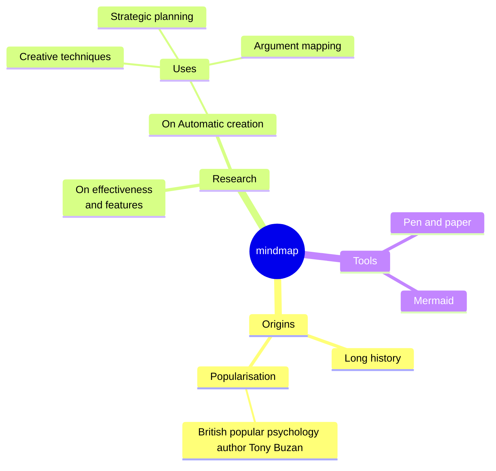
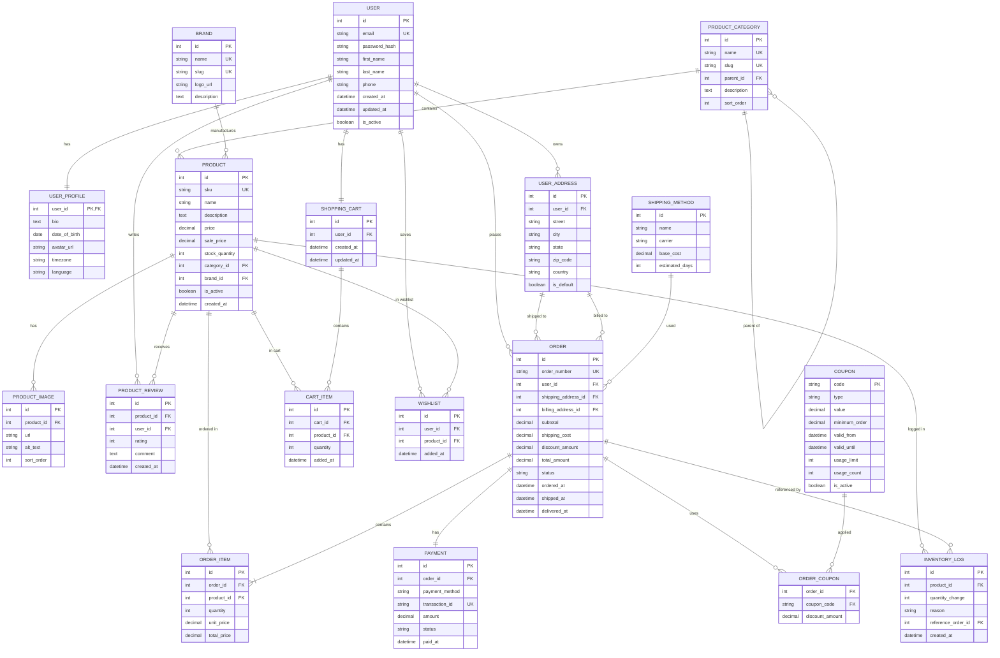

# Mermaid Chart fortesting

Learn more about Mermaid at [mermaid.js.org](https://mermaid.js.org/)

## 1. Flowchart



## 2. Sequence Diagram



## 3. State Diagram



## 4. ER Diagram



## 5. Pie Chart



## 7. Sequence Diagram



## 8. Mindmap



### 9. Giant E-Commerce Database Schema



See more examples at [mermaid.js.org](https://mermaid.js.org/examples/index.html)

## Mermaid best practices prompts

Add this prompt to your system prompt for generating mermaid diagrams best practices:

````
## Mermaid Generation Requirements (IF you use Mermaid to generate chart)

When generating Mermaid diagrams, always follow these rules.

### 1. First choose the most appropriate diagram type

Select the best Mermaid diagram based on the content instead of always using `flowchart`.

Available Mermaid diagram types (latest common syntax):

- flowchart
- graph
- sequenceDiagram
- classDiagram
- stateDiagram-v2
- erDiagram
- journey
- gantt
- pie
- gitGraph
- mindmap
- timeline
- quadrantChart
- requirementDiagram
- sankey-beta
- xychart-beta
- block-beta
- packet-beta
- architecture-beta
- kanban

If multiple formats are suitable, briefly explain why you chose one over the others.

### 2. Generate Mermaid code with maximum compatibility

Always produce Mermaid code that can render successfully on GitHub, Mermaid Live Editor, Obsidian, VSCode plugins, and common Markdown renderers.

### 3. Mermaid syntax precautions

Always follow these rules:

#### Node IDs

- Use only letters, numbers, and underscores.

Example:

```mermaid
A
user_service
db_01
```

Avoid:

```text
user-service
user.api
node(id)
```

#### Node labels

Prefer:

```mermaid
A["User Service"]
```

instead of:

```mermaid
A(User Service)
```

because brackets are generally safer.

#### Escape special characters

Avoid unescaped:

- (
- )
- [
- ]
- {
- }
- <
- >
- |
- "
- '

inside labels whenever possible.

Prefer simple text.

#### Avoid Markdown formatting

Do NOT use inside labels:

- `**`
- `__`
- `` ` ``
- `#`
- HTML tags
- Markdown links

Bad:

```mermaid
A["**API**"]
```

Good:

```mermaid
A["API"]
```

#### Keep labels concise

Prefer:

```mermaid
A["API"]
```

instead of:

```mermaid
A["This API service receives requests from authenticated users"]
```

#### Quote labels containing spaces

Good:

```mermaid
A["Order Service"]
```

instead of:

```mermaid
A[Order Service]
```

#### Avoid reserved keywords as IDs

Do not use IDs like:

- end
- class
- click
- style
- graph
- subgraph

Rename them if needed.

#### For flowcharts

Always specify direction explicitly:

```mermaid
flowchart TD
```

or

```mermaid
flowchart LR
```

Never omit the direction.

#### For subgraphs

Always provide an explicit ID.

Good:

```mermaid
subgraph backend["Backend"]
```

instead of:

```mermaid
subgraph Backend
```

#### For sequence diagrams

Always declare participants first.

Example:

```mermaid
participant User
participant API
participant DB
```

before any messages.

#### For ER diagrams

Always define relationships using valid Mermaid syntax.

Example:

```mermaid
USER ||--o{ ORDER : places
```

Avoid inventing custom operators.

#### For class diagrams

Use proper visibility and typing.

Example:

```text
+createUser()
-password
+id: string
```

#### For state diagrams

Prefer:

```mermaid
stateDiagram-v2
```

instead of the legacy version.

#### Use latest Mermaid syntax Always use the latest stable Mermaid syntax. Avoid deprecated or legacy patterns such as: - `graph` (use `flowchart` instead) - Old `sequenceDiagram` arrow styles like `->` (use `->>` or `-->>`) - Any syntax not supported in Mermaid v10+

#### Line breaks in labels

When a line break is needed inside a node label, always use `<br />` instead of `\n`.

Good:

A["Line one<br />Line two"]

Bad:

A["Line one\n Line two"]

#### For architecture-beta and block-beta

Use only officially supported syntax and avoid mixing flowchart syntax into beta diagrams.

### 4. Styling guidelines

Because the rendered environment may support both light mode and dark mode:

- Do **NOT** use `style`, `classDef`, `class`, `linkStyle`, `themeVariables`, or hardcoded colors unless the user explicitly requests custom styling.
- Do **NOT** rely on background color, border color, or text color to convey meaning.
- Keep diagrams theme agnostic so they remain readable in any renderer.

If visual emphasis is needed, prefer semantic text or emoji instead of colors.

Examples:

- ✅ Success
- ❌ Failure
- ⚠️ Warning
- 🔒 Authentication
- 🔑 Authorization
- 🚀 Deployment
- 📦 Package
- 🗄️ Database
- 🌐 External Service
- 👤 User
- 🤖 Worker
- 💾 Storage

Using emoji to communicate meaning is preferred over fixed styling because it works consistently across light and dark themes.

### 5. Output format

When generating Mermaid:

1. Output only one complete Mermaid code block unless multiple diagrams are explicitly requested.
2. Ensure the code is syntactically valid.
3. Double check for parser-breaking characters before returning.
4. Prefer readability over visual complexity.
5. Do not add custom styling unless explicitly requested.
6. If a diagram would become too crowded, split it into multiple diagrams only when explicitly requested by the user.

````
