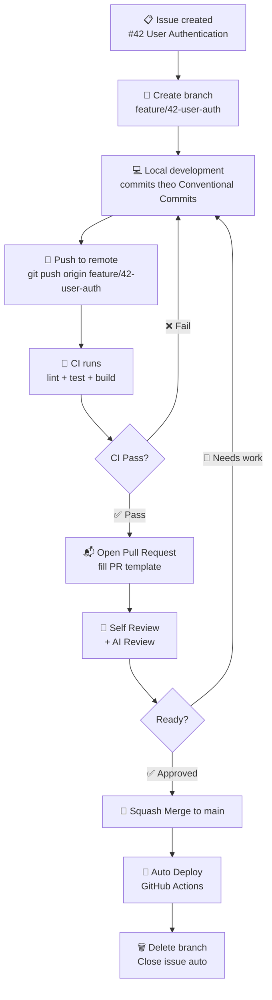
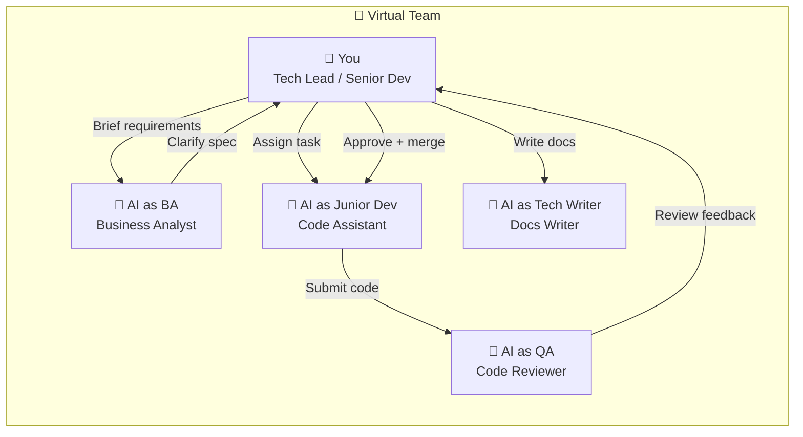
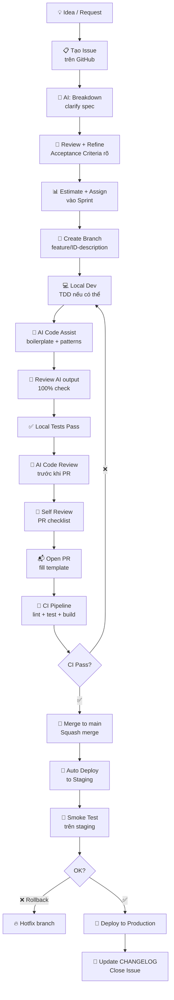

# Solo Dev Operating Like a Team

## Bộ tài liệu vận hành cho solo developer — sẵn sàng join team lớn, lead team nhỏ, build from zero

> **3 keywords xuyên suốt tài liệu này: `solo` · `ai` · `ready`**

---

## Mục lục

1. [Mindset & Philosophy](#1-mindset--philosophy)
2. [Project Structure](#2-project-structure)
3. [Tool Stack — Chọn cụ thể, không "tùy bạn"](#3-tool-stack)
4. [Git Workflow](#4-git-workflow)
5. [Agile as a Solo Dev](#5-agile-as-a-solo-dev)
6. [AI as a Team Member](#6-ai-as-a-team-member)
7. [Daily Routine của Solo Dev](#7-daily-routine)
8. [Development Workflow — Từ idea đến production](#8-development-workflow)
9. [Open Source Readiness](#9-open-source-readiness)
10. [Closed Source — Những gì khác biệt](#10-closed-source)
11. [Ready Signals — Checklist](#11-ready-signals)

---

## 1. Mindset & Philosophy

### Tại sao vận hành như team ngay từ đầu?

Tôi đã từng lead team 10 người. Khi quay lại làm solo, sai lầm lớn nhất có thể mắc phải là "đơn giản hóa quy trình vì chỉ có mình". Điều đó tạo ra nợ kỹ thuật không phải trong code, mà trong **process**.

Khi một contributor mới vào open source project của bạn — họ không biết bạn đang nghĩ gì. Khi HR của một công ty lớn nhìn vào GitHub của bạn — họ đánh giá không chỉ code mà cả **cách bạn làm việc**.

```
Solo dev tệ:        Solo dev tốt (tài liệu này):
─────────────────   ──────────────────────────────
Code trong đầu      Issues rõ ràng
Branch random       Git workflow nhất quán
Deploy "cho xong"   CI/CD + staging
Không docs          README + CONTRIBUTING + Wiki
AI dùng như Google  AI có role trong team
```

### Ba nguyên tắc cốt lõi

**`SOLO`** — Bạn là người thực hiện, nhưng không để tư duy "chỉ mình tôi hiểu" xâm nhập vào codebase.

**`AI`** — AI không phải tool vặt vãnh. AI là junior dev, BA, QA, reviewer — tùy context. Bạn là senior quyết định cuối cùng.

**`READY`** — Mọi quyết định đều hỏi: _"Nếu ngày mai có thêm 3 người vào team, họ có hiểu được không?"_

---

## 2. Project Structure

### 2.1 Folder layout chuẩn

```
my-project/
├── .github/
│   ├── ISSUE_TEMPLATE/
│   │   ├── bug_report.md
│   │   ├── feature_request.md
│   │   └── task.md
│   ├── PULL_REQUEST_TEMPLATE.md
│   ├── workflows/
│   │   ├── ci.yml
│   │   ├── release.yml
│   │   └── preview.yml
│   └── CODEOWNERS
├── docs/
│   ├── architecture.md
│   ├── adr/                    ← Architecture Decision Records
│   │   └── 001-use-postgres.md
│   └── contributing/
│       └── setup.md
├── src/
├── tests/
├── scripts/
│   ├── setup.sh
│   └── seed.sh
├── .env.example                ← KHÔNG commit .env thật
├── CHANGELOG.md
├── CONTRIBUTING.md
├── README.md
└── package.json / pyproject.toml / go.mod
```

### 2.2 README — Chuẩn của một project nghiêm túc

README phải trả lời được 5 câu hỏi trong 30 giây:

```
# Project Name

> One-line mô tả project làm gì

## 🚀 Quick Start        ← Chạy được trong < 5 phút
## 📖 Documentation      ← Link đến docs/
## 🤝 Contributing       ← Link đến CONTRIBUTING.md
## 🗺️ Roadmap            ← Link đến GitHub Projects board
## 📄 License
```

### 2.3 Architecture Decision Records (ADR)

Mỗi khi quyết định một thứ quan trọng (chọn database, chọn framework, chọn auth strategy) — viết ADR. Format đơn giản:

```markdown
# ADR-001: Dùng PostgreSQL thay vì MongoDB

## Status: Accepted

## Context

Project cần quan hệ giữa User, Order, Product phức tạp.

## Decision

Dùng PostgreSQL.

## Consequences

- ACID transactions, joins mạnh

* Cần migration khi thay đổi schema
```

**Lý do:** Khi người mới vào hỏi "sao không dùng X?" — bạn không cần giải thích lại từ đầu.

---

## 3. Tool Stack

> Nguyên tắc chọn tool: **ít friction nhất cho solo dev**, **dễ onboard nhất cho contributor**.

### 3.1 Project Management — Chọn GitHub Projects

| Tool                      | Pros                                                                                                 | Cons                                           |
| ------------------------- | ---------------------------------------------------------------------------------------------------- | ---------------------------------------------- |
| **GitHub Projects v2** ✅ | Native với repo, free, có Kanban + backlog + iteration (sprint), contributor không cần tài khoản mới | UI còn đơn giản hơn Jira                       |
| Jira                      | Mạnh, nhiều tính năng                                                                                | Overkill cho solo, contributor phải có account |
| Linear                    | Đẹp, nhanh                                                                                           | Không native với GitHub, thêm một app nữa      |
| Notion                    | Flexible                                                                                             | Không phải project management tool thực sự     |

**Tôi chọn GitHub Projects vì:** Open source project cần zero friction cho contributor. Mọi thứ ở một nơi — issue, PR, board, roadmap. Không cần tài khoản thứ hai.

**GitHub Projects có Agile không?** Có đủ:

- ✅ Kanban board
- ✅ Backlog view
- ✅ Iteration (Sprint) — tạo và assign issue vào sprint
- ✅ Custom fields (Priority, Story Points, Type)
- ✅ Roadmap (timeline view)
- ✅ Automation (auto-move card khi PR merged)

### 3.2 Closed Source — Đổi tool không?

Với closed source project có team, tôi dùng **Linear**. Lý do: tốc độ tạo issue nhanh hơn, keyboard-driven, integration với Slack tốt hơn. Nhưng workflow agile giữ nguyên — chỉ đổi UI.

### 3.3 Full Tool Stack

```
Code          : VS Code + Cursor (AI-assisted)
Repo          : GitHub
CI/CD         : GitHub Actions
Project Mgmt  : GitHub Projects (open source) / Linear (closed source)
Docs          : Markdown in repo + GitHub Wiki
Communication : GitHub Discussions (open source) / Slack (team)
Secrets       : .env.example + Doppler hoặc GitHub Secrets
Monitoring    : Sentry (errors) + Uptime Robot (uptime)
```

---

## 4. Git Workflow

### 4.1 Branch Strategy — Chọn GitHub Flow

Có 3 chiến lược phổ biến:

```
Git Flow:      main ← develop ← feature/hotfix/release
               Phức tạp, phù hợp release cycle dài

GitHub Flow:   main ← feature-branch
               Đơn giản, deploy liên tục ✅ Tôi chọn cái này

Trunk Based:   main (commit thẳng, feature flags)
               Phù hợp team lớn có CI mạnh
```

**Tôi chọn GitHub Flow vì:** Solo dev không cần branch `develop` thêm một tầng phức tạp. Deploy được khi merge vào `main`. Đơn giản, dễ contributor hiểu.

**Ngoại lệ:** Nếu project có release cycle (ví dụ library/package có version), tôi thêm `release/x.x.x` branch — nhưng vẫn giữ GitHub Flow cho feature development.

### 4.2 Branch Naming Convention

```
feature/   ← tính năng mới
fix/       ← bug fix
chore/     ← không ảnh hưởng logic (update deps, config)
docs/      ← chỉ docs
refactor/  ← refactor không thay đổi behavior
hotfix/    ← fix khẩn cấp trên production
```

Format: `type/issue-id-short-description`

```bash
feature/42-user-authentication
fix/87-login-redirect-loop
docs/update-contributing-guide
hotfix/91-null-pointer-on-checkout
```

### 4.3 Commit Convention — Conventional Commits

Tôi dùng [Conventional Commits](https://www.conventionalcommits.org/):

```
<type>(<scope>): <description>

[optional body]

[optional footer: refs #issue-id]
```

**Types:**

```
feat:     tính năng mới
fix:      bug fix
docs:     thay đổi documentation
style:    formatting (không thay đổi logic)
refactor: refactor code
test:     thêm/sửa test
chore:    build process, dependencies
perf:     cải thiện performance
ci:       thay đổi CI/CD config
```

**Ví dụ thực tế:**

```bash
feat(auth): add Google OAuth login

Implement OAuth 2.0 flow with Google provider.
Includes token refresh and session management.

refs #42

fix(checkout): prevent double submit on slow connection

Added debounce on submit button and loading state.

refs #87

chore: upgrade dependencies to latest stable
```

**Lý do dùng Conventional Commits:**

- CHANGELOG.md tự generate được bằng `conventional-changelog`
- Semantic versioning tự động (feat = minor, fix = patch)
- Dễ review commit history
- CI có thể enforce bằng `commitlint`

### 4.4 Pull Request Process

**PR Template (`.github/PULL_REQUEST_TEMPLATE.md`):**

```markdown
## 📋 Mô tả

<!-- Thay đổi này làm gì? -->

## 🔗 Liên quan

Closes #<!-- issue number -->

## ✅ Checklist

- [ ] Code đã tự review
- [ ] Tests đã pass
- [ ] Docs đã update (nếu cần)
- [ ] Không có console.log / debug code

## 📸 Screenshots (nếu có UI thay đổi)
```

**PR Rules:**

- PR nhỏ — tối đa 400 lines changed (nếu hơn, cần lý do)
- Mỗi PR map với ít nhất 1 issue
- Squash merge vào main (giữ history sạch)
- Branch xóa sau khi merge

### 4.5 Git Workflow Diagram



---

## 5. Agile as a Solo Dev

### 5.1 Tại sao Agile với solo?

Không phải để ceremony. Mà để:

- Không bị lost trong biển việc
- Có thể nói được "sprint này tôi làm được gì" — với nhà tuyển dụng, với chính mình
- Sẵn sàng khi team expand

### 5.2 Cấu trúc Sprint

**Sprint duration:** 1 tuần (solo dev — 2 tuần dễ drift)

```
Monday      : Sprint Planning (30 phút)
Mon–Fri     : Daily standup với chính mình (5 phút)
Friday      : Sprint Review + Retrospective (20 phút)
```

### 5.3 Backlog Management trên GitHub Projects

**Cấu trúc board:**

```
┌─────────────┬──────────────┬─────────────┬──────────────┬──────────┐
│   Backlog   │  This Sprint │ In Progress │  In Review   │   Done   │
├─────────────┼──────────────┼─────────────┼──────────────┼──────────┤
│ #45 OAuth   │ #42 Auth     │ #38 UI nav  │ #35 Fix bug  │ #30 API  │
│ #46 Export  │ #43 Profile  │             │              │ #31 DB   │
│ #47 Notif   │ #44 Logout   │             │              │          │
└─────────────┴──────────────┴─────────────┴──────────────┴──────────┘
```

**Custom Fields trong GitHub Projects:**

| Field        | Type      | Values                                     |
| ------------ | --------- | ------------------------------------------ |
| Priority     | Select    | 🔴 Critical / 🟠 High / 🟡 Medium / 🟢 Low |
| Type         | Select    | Feature / Bug / Chore / Docs               |
| Story Points | Number    | 1, 2, 3, 5, 8 (Fibonacci)                  |
| Sprint       | Iteration | Sprint 1, Sprint 2...                      |

### 5.4 Issue Template

**Feature Request template (`.github/ISSUE_TEMPLATE/feature_request.md`):**

```markdown
---
name: Feature Request
about: Đề xuất tính năng mới
labels: feature
---

## 🎯 User Story

As a [role], I want to [action] so that [benefit].

## ✅ Acceptance Criteria

- [ ] Criteria 1
- [ ] Criteria 2

## 📐 Technical Notes

<!-- Implementation ideas, constraints -->

## 🎨 Design (nếu có)

<!-- Figma link hoặc sketch -->
```

### 5.5 Sprint Planning (Solo Version)

**Thứ Hai sáng, 30 phút:**

```
1. Review backlog — 10 phút
   - Triage issues mới
   - Reorder priority

2. Chọn sprint goal — 5 phút
   - 1 câu: "Sprint này ship được X"

3. Pull issues vào sprint — 10 phút
   - Estimate story points
   - Không overcommit: capacity = 20-25 points/tuần solo

4. Ghi sprint goal vào GitHub Projects description — 5 phút
```

### 5.6 Retrospective (Solo Version)

**Thứ Sáu, 20 phút — viết vào `docs/retro/YYYY-MM-DD.md`:**

```markdown
# Retro Sprint 12 — 2025-01-17

## ✅ What went well

- Ship được auth flow đúng hạn
- AI review giúp catch 2 bugs trước merge

## ❌ What didn't go well

- Estimate sai: #42 mất 5 points thay vì 3
- Bị context switch nhiều vì Slack notifications

## 🔧 Action items

- [ ] Tắt Slack notification trong deep work hours
- [ ] Break large issues xuống ≤ 3 points
```

---

## 6. AI as a Team Member

> AI không phải tool. AI là thành viên team có role cụ thể. Bạn là Tech Lead — AI là junior report to you.

### 6.1 AI Roles trong Team



### 6.2 Structured Prompting — AI như Junior Dev

AI cho ra output tốt khi được brief rõ như giao việc cho junior dev thật.

**Template prompt cho coding task:**

```
## Role
You are a senior backend developer helping implement a feature.

## Context
Project: [tên project, stack]
Current code: [paste relevant code]

## Task
Implement [feature] following these requirements:
- [Requirement 1]
- [Requirement 2]

## Constraints
- Không thay đổi existing API contract
- Phải có unit test
- Follow existing code style (xem file X)

## Output format
1. Implementation code
2. Unit tests
3. Brief explanation của approach
```

### 6.3 AI as Code Reviewer

Trước khi tạo PR, tôi luôn chạy AI review:

```
## Role
You are a senior code reviewer doing PR review.

## Code to review
[paste diff]

## Review checklist
- [ ] Logic correctness
- [ ] Edge cases
- [ ] Security issues (injection, auth bypass...)
- [ ] Performance issues (N+1 query, memory leak...)
- [ ] Code style consistency
- [ ] Missing error handling

## Output format
List issues theo severity: Critical / Major / Minor / Nitpick
```

### 6.4 AI as BA — Breakdown Task

Khi có một requirement mơ hồ:

```
## Role
You are a Business Analyst breaking down requirements.

## Feature request
[paste raw requirement]

## Output
1. Clarify ambiguities (list questions nếu có)
2. User stories theo format: As a [role], I want [action] so that [benefit]
3. Acceptance criteria cho mỗi story
4. Technical considerations
5. Estimate complexity: Low / Medium / High
```

### 6.5 AI Workflow trong Sprint

```
Idea → AI breakdown → Tôi review → Issue → AI code assist → Tôi review → AI QA review → PR → Merge
```

**Nguyên tắc:**

- AI generate, tôi review 100% trước khi commit
- Không blind trust AI output — đặc biệt với security, business logic
- AI giỏi boilerplate, pattern, docs — yếu ở domain knowledge cụ thể của project

---

## 7. Daily Routine

> Đây không phải ritual cứng nhắc. Đây là framework để không bị lost và maintain context.

### 7.1 Overview một ngày làm việc

```
07:30  ┌─────────────────────────────┐
       │  🌅 Morning Startup         │  15 phút
08:00  ├─────────────────────────────┤
       │  🎯 Deep Work Block 1       │  2.5 giờ
       │  (Feature / Complex task)   │
10:30  ├─────────────────────────────┤
       │  ☕ Break                   │  15 phút
10:45  ├─────────────────────────────┤
       │  🔄 Review / PR / Issues    │  1 giờ
       │  (shallow work)             │
11:45  ├─────────────────────────────┤
       │  🍽️ Lunch                  │  1 giờ
12:45  ├─────────────────────────────┤
       │  🎯 Deep Work Block 2       │  2 giờ
       │  (Continue feature / Bug)   │
14:45  ├─────────────────────────────┤
       │  📝 Docs / Chores / AI tasks│  1 giờ
15:45  ├─────────────────────────────┤
       │  🔍 Code Review + Testing   │  45 phút
16:30  ├─────────────────────────────┤
       │  🌇 End of Day Wrap-up      │  15 phút
16:45  └─────────────────────────────┘
```

### 7.2 Morning Startup (15 phút)

**Không mở email, Slack trước — mở GitHub Projects trước.**

```
1. Mở GitHub Projects board (2 phút)
   → Nhìn sprint board: hôm nay tôi cần move gì?

2. Standup với chính mình (3 phút) — viết ra:
   "Yesterday: [làm gì xong]
    Today: [sẽ làm gì]
    Blockers: [có gì chặn không]"

3. Xem notifications GitHub (5 phút)
   → PR comments, issue mentions
   → Không rabbit hole ở đây

4. Set intention cho deep work block (5 phút)
   → Chọn 1 task chính cho buổi sáng
   → Open relevant files, close irrelevant tabs
```

### 7.3 Deep Work Blocks — Không bị interrupt

**Trong deep work block:**

- Tắt Slack notifications
- Close email
- Chỉ mở: editor + terminal + browser (relevant tabs)
- Dùng Pomodoro nếu cần focus: 25 phút code + 5 phút break

**Commit thường xuyên trong block — mỗi 30-60 phút:**

```bash
git add .
git commit -m "feat(auth): implement JWT token generation [WIP]"
```

WIP commits ổn trong branch — squash khi tạo PR.

### 7.4 Review / PR / Issues Block (Shallow Work)

Đây là thời gian dành cho các việc không cần deep focus:

```
- Respond GitHub issues / discussions
- Review AI-generated code
- Triage backlog issues mới
- Update GitHub Projects board
- Merge PR nếu CI pass
```

### 7.5 End of Day Wrap-up (15 phút)

```
1. Update board (2 phút)
   → Move cards đúng cột
   → Add comment vào issue đang làm: "Progress: X done, Y remaining"

2. Commit & push WIP (3 phút)
   → Không để uncommitted code qua đêm

3. Write tomorrow's intention (5 phút)
   → Một dòng: "Tomorrow: continue #42, then start #43"

4. Close everything (5 phút)
   → Đóng tabs, terminal sessions
   → Mental separation: work done
```

### 7.6 Weekly Rhythm

```
Monday    : Sprint Planning (30') + Deep Work
Tue–Thu   : Full deep work days
Friday    : Sprint Review (20') + Retro (20') + Light tasks + Docs
```

### 7.7 Context Switching — Kẻ thù của Solo Dev

**Khi bị interrupt:**

```bash
# Trước khi switch context — luôn làm điều này:
git stash  # hoặc commit WIP
# Ghi note vào issue comment: "Đang làm đến đây, next: X"
```

**Interrupt budget:** Tối đa 2 planned interrupts/ngày. Ngoài ra: async.

---

## 8. Development Workflow

### 8.1 Từ Idea đến Production



### 8.2 CI/CD Pipeline

**GitHub Actions — `.github/workflows/ci.yml`:**

```yaml
name: CI

on:
  push:
    branches: [main]
  pull_request:
    branches: [main]

jobs:
  quality:
    runs-on: ubuntu-latest
    steps:
      - uses: actions/checkout@v4
      - name: Setup
        uses: actions/setup-node@v4
      - name: Install
        run: npm ci
      - name: Lint
        run: npm run lint
      - name: Type check
        run: npm run type-check
      - name: Test
        run: npm run test:coverage
      - name: Build
        run: npm run build
```

**Nguyên tắc CI:**

- CI phải chạy dưới 5 phút — nếu lâu hơn, cần cache
- Fail fast — lint trước, test sau
- Coverage threshold: tối thiểu 70% cho new code

### 8.3 Environments

```
local     → Development
staging   → Pre-production (auto deploy từ main)
production → Live (manual trigger hoặc tag release)
```

---

## 9. Open Source Readiness

> Mục tiêu: Người lạ vào repo, tự setup và submit PR trong dưới 30 phút, không cần hỏi bạn.

### 9.1 Zero-Friction Contributor Experience

**Checklist bắt buộc:**

```
✅ README có Quick Start chạy được < 5 phút
✅ CONTRIBUTING.md đầy đủ (xem mẫu bên dưới)
✅ Issue templates (bug, feature, task)
✅ PR template
✅ .env.example với tất cả biến và comment giải thích
✅ setup.sh hoặc Makefile để one-command setup
✅ Good first issue label cho newcomers
✅ Code of Conduct
✅ License rõ ràng
```

### 9.2 CONTRIBUTING.md — Cấu trúc chuẩn

```markdown
# Contributing Guide

## 🚀 Getting Started

1. Fork repo
2. Clone: `git clone ...`
3. Setup: `./scripts/setup.sh`
4. Copy env: `cp .env.example .env`

## 🛠️ Development

- `npm run dev` — start dev server
- `npm test` — run tests
- `npm run lint` — check code style

## 📋 How to Contribute

1. Find an issue (hoặc tạo mới)
2. Comment "I'm working on this" để tránh duplicate
3. Create branch: `feature/ID-description`
4. Commit theo Conventional Commits
5. Open PR với description rõ ràng

## 🎯 Branch Naming

feature/ fix/ docs/ chore/

## 📝 Commit Convention

[Conventional Commits link]

## ❓ Questions

Open a GitHub Discussion.
```

### 9.3 Issue Management cho Open Source

**Labels hệ thống:**

```
Type:     bug · feature · docs · chore · question
Priority: critical · high · medium · low
Status:   needs-triage · in-progress · blocked · wontfix
Special:  good-first-issue · help-wanted · hacktoberfest
```

**Triage routine — mỗi thứ Hai:**

- Issue mới không có label → add label
- Issue > 7 ngày không ai pick → add `help-wanted`
- Issue không rõ ràng → comment hỏi, add `needs-more-info`

---

## 10. Closed Source — Những gì khác biệt

> Closed source không phải open source bị giảm tính năng. Nó có những ưu tiên khác.

## 10.1 Khác biệt chính

| Aspect           | Open Source             | Closed Source                            |
| ---------------- | ----------------------- | ---------------------------------------- |
| Contributor      | Bất kỳ ai               | Team cố định                             |
| Docs             | Phải cực kỳ rõ          | Internal wiki đủ dùng                    |
| Issue visibility | Public                  | Private (Jira / Linear / GitHub Private) |
| Security         | Cần careful với secrets | Thêm layer secrets management            |
| Licensing        | Rõ ràng                 | IP protection cần thiết                  |
| Branching        | Giữ nguyên              | Giữ nguyên                               |
| CI/CD            | Giữ nguyên              | Thêm staging environments phức tạp hơn   |

## 10.2 Secrets Management — Closed Source

```
Development  : .env local (không commit)
CI/CD        : GitHub Secrets / GitLab Variables
Production   : AWS Secrets Manager / Doppler / Vault
```

**Không bao giờ:**

```bash
# KHÔNG BAO GIỜ làm này:
git add .env
git commit -m "add env file"

# Nếu lỡ commit secrets:
git filter-branch hoặc BFG Repo Cleaner
Rotate secrets NGAY LẬP TỨC
```

## 10.3 Khi Team Expand — Từ kinh nghiệm lead 10 người

Từng lead team 10 người, những gì tôi học được cho lúc scale up:

```
Solo → Small team (2-5):
- Giữ nguyên toàn bộ workflow ở trên
- Thêm: Code review bắt buộc từ 1 người khác
- Thêm: Weekly sync 30 phút (không cần daily standup full ceremony)
- CODEOWNERS để review không bị miss

Small team → Medium team (6-10):
- Tách thành sub-teams với ownership rõ ràng
- Thêm: Architecture review cho changes lớn
- Thêm: On-call rotation
- Jira hoặc Linear thay GitHub Projects (cần reporting phức tạp hơn)
- Thêm: Team working agreement document
```

**Working Agreement template (khi có team):**

```markdown
# Team Working Agreement

## Core Hours: 9:00 - 16:00 (flexible ngoài giờ này)

## Response time: Slack < 4 giờ trong core hours

## PR size: < 400 lines preferred

## Review SLA: 24 giờ cho PR review

## Meeting: Không meeting thứ Tư (deep work day)

## Retro: Mỗi 2 tuần, blameless
```

---

## 11. Ready Signals

### 11.1 Ready to Join a Large Team ✅

```
□ Git workflow rõ ràng — không cần ai giải thích
□ Commit history đọc được như changelog
□ PR description rõ: context, changes, testing
□ Biết khi nào cần review, khi nào tự quyết
□ Có ADRs — quyết định có documented reasoning
□ CI/CD hiểu và maintain được
□ Không hỏi "tôi làm gì tiếp theo" — tự look at backlog
□ Code review: give + receive feedback professionally
□ Estimate được story points (và biết mình hay sai bao nhiêu %)
```

### 11.2 Ready to Lead a Small Team ✅

```
□ Biết tạo và maintain sprint structure
□ Biết viết issue đủ rõ để người khác implement không cần hỏi
□ Biết triage và priority backlog
□ Biết unblock người khác — không hoard knowledge
□ Retrospective: facilitate được, blameless culture
□ Working agreement: tạo và enforce được
□ Onboarding: người mới setup được trong 1 ngày
□ Delegation: biết giao cho AI vs junior vs senior
□ Architecture decisions: document và communicate rõ
```

### 11.3 Ready to Build from Zero ✅

```
□ Project structure từ ngày 1 — không "sẽ refactor sau"
□ README trước khi code — nếu không giải thích được, chưa rõ scope
□ CI/CD từ ngày 1 — không "add sau khi có feature"
□ .env.example từ ngày 1
□ CHANGELOG.md từ ngày 1
□ GitHub Projects setup trước sprint 1
□ Tech stack decision documented (ADR)
□ Có thể estimate rough timeline và communicate tradeoffs
□ Biết khi nào MVP đủ ship và khi nào cần polish thêm
```

### 11.4 What Hiring Managers See

Khi HR / Tech Lead nhìn vào GitHub của bạn, họ thấy:

```
Người khác thấy:              Họ đọc được:
──────────────────────────    ──────────────────────────────────
Commit messages rõ ràng   →  "Người này communicate được"
Issues có acceptance      →  "Người này tư duy product"
criteria
ADRs trong docs/          →  "Người này ra quyết định có lý do"
PR nhỏ, focused           →  "Người này biết scope work"
CI green liên tục         →  "Người này responsible với quality"
CONTRIBUTING.md           →  "Người này nghĩ đến người khác"
Retrospective notes       →  "Người này self-aware và improve"
```

---

## Appendix — Quick Reference

## Git Cheat Sheet hàng ngày

```bash
# Start a new task
git checkout main && git pull
git checkout -b feature/42-short-description

# Regular commits
git add -p  # review từng hunk trước khi add
git commit -m "feat(scope): description"

# Before PR
git fetch origin
git rebase origin/main  # keep history clean
git push origin feature/42-short-description

# Stash khi cần context switch nhanh
git stash push -m "WIP: auth flow half done"
git stash pop
```

## GitHub Projects Keyboard Shortcuts

```
C     → Tạo issue mới
/     → Search
F     → Filter
Ctrl+K → Command palette
```

### AI Prompt Templates Quick Reference

```
[BA Mode]    "Break down this requirement into user stories with AC..."
[Dev Mode]   "Implement X following these constraints: ..."
[Review Mode] "Review this code for: correctness, security, performance..."
[Docs Mode]  "Write technical documentation for this function/API..."
[Debug Mode] "Help debug this issue. Error: ... Context: ... Expected: ..."
```

---

_Tài liệu này là living document — update sau mỗi project hoặc khi quy trình thay đổi._

_Last updated: 2025_
