# Mermaid Diagrams in mdsvr

mdsvr supports **Mermaid.js** for creating beautiful diagrams directly in your Markdown files. Simply wrap your Mermaid code in triple backticks with the `mermaid` language identifier, and mdsvr will render it as an interactive diagram.

## Quick Start

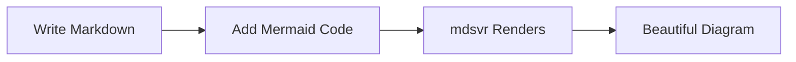

**Syntax:** All Mermaid diagrams start with a diagram type keyword, followed by the content.

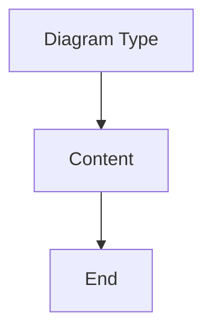

**Comments:** Use `%%` to add comments that won't be rendered.

---

## Supported Diagram Types

mdsvr supports all 19 Mermaid diagram types. Below is a complete showcase with practical examples.

---

## 1. Flowchart

**Best for:** Process flows, workflows, decision trees, algorithms.

### Example: User Authentication Flow

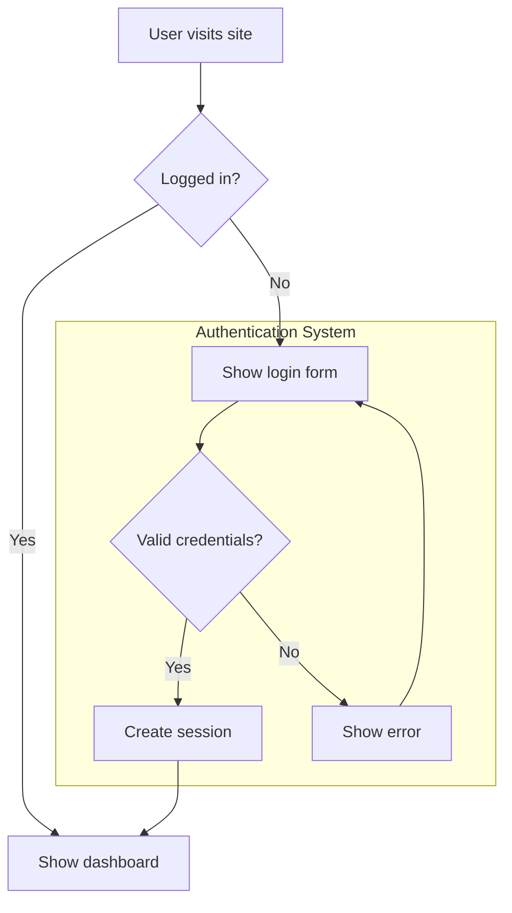

### Syntax Guide

**Directions:** `TD` (top-down), `LR` (left-right), `BT` (bottom-up), `RL` (right-left)

**Node shapes:**

- `A["Text"]` - Rectangle
- `B("Text")` - Rounded
- `C{"Text"}` - Diamond (decision)
- `D(("Text"))` - Circle
- `E(["Text"])` - Stadium

**Arrows:** `-->` (arrow), `---` (line), `-.->` (dotted), `==>` (thick)

**Labels:** `A -->|"label"| B`

---

## 2. Sequence Diagram

**Best for:** API documentation, authentication flows, message exchanges between systems.

### Example: API Authentication Flow

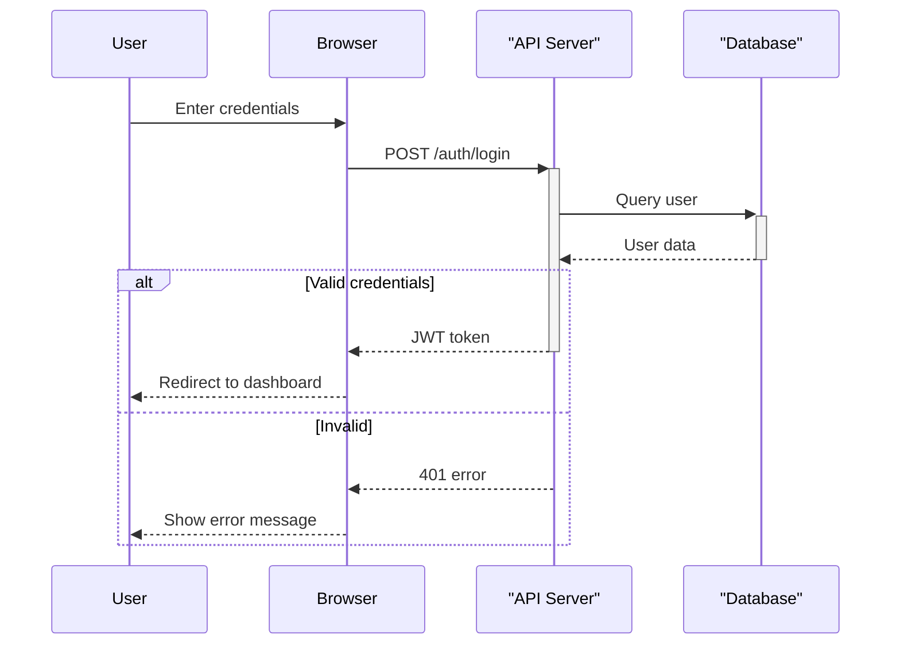

### Syntax Guide

**Participants:** `participant Name as "Display Name"`

**Arrows:**

- `->>` - Solid (request)
- `-->>` - Dashed (response)
- `->>+` - Activate
- `-->>-` - Deactivate

**Blocks:** `loop`, `alt/else`, `opt`, `par/and`, `critical`

---

## 3. Class Diagram

**Best for:** Software architecture, OOP structure, data models.

### Example: E-commerce System

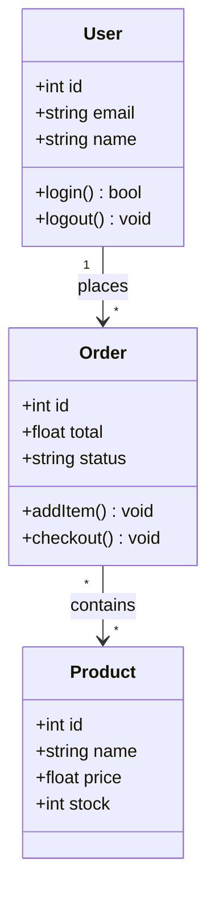

### Syntax Guide

**Visibility:** `+` (public), `-` (private), `#` (protected), `~` (package)

**Relationships:**

- `<|--` - Inheritance
- `*--` - Composition
- `o--` - Aggregation
- `-->` - Association

**Cardinality:** `"1"`, `"0..1"`, `"*"`, `"1..*"`

---

## 4. State Diagram

**Best for:** State machines, lifecycles, process states.

### Example: Document Lifecycle

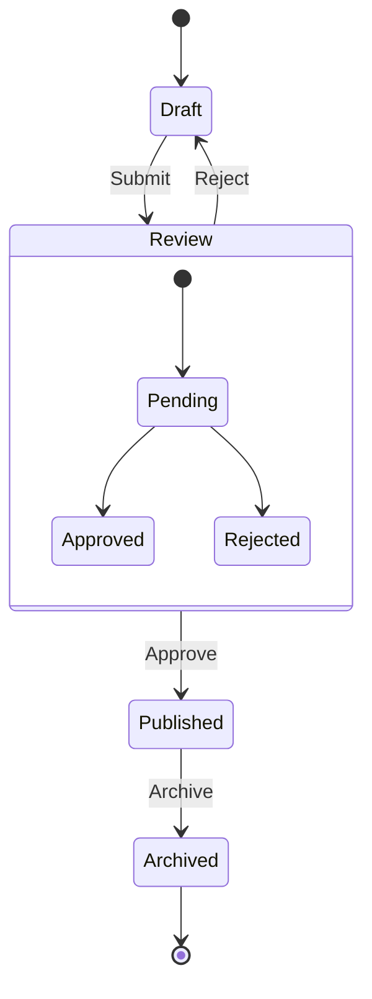

---

## 5. ER Diagram

**Best for:** Database schemas, data modeling.

### Example: Blog Database Schema

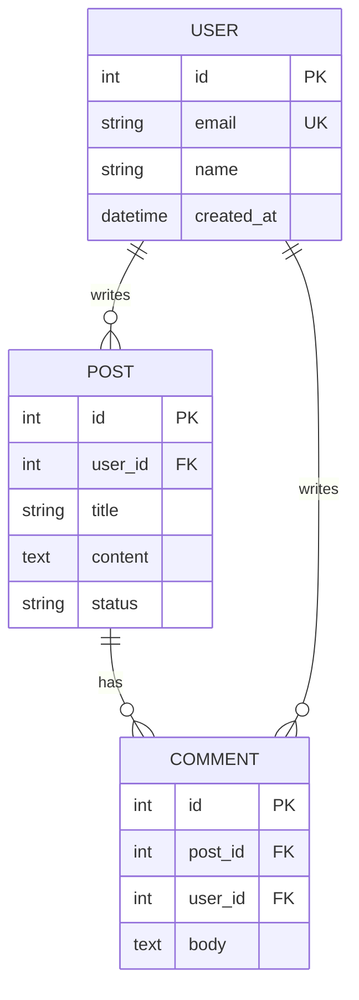

### Syntax Guide

**Relationships:**

- `||--||` - One to one
- `||--o{` - One to zero or more
- `||--|{` - One to one or more
- `}o--o{` - Zero or more to zero or more

**Keys:** `PK` (primary), `FK` (foreign), `UK` (unique)

---

## 6. Gantt Chart

**Best for:** Project planning, timelines, sprint schedules.

### Example: Project Timeline

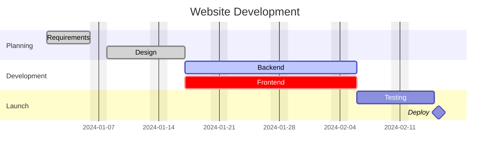

### Syntax Guide

**Status:** `done`, `active`, `crit` (critical), `milestone`

**Duration:** `5d` (days), `2w` (weeks), `after task_id`

---

## 7. User Journey

**Best for:** UX design, customer experience mapping.

### Example: E-commerce Checkout

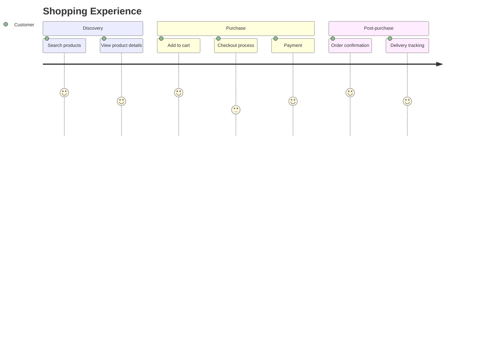

### Syntax Guide

**Score:** 1 (very bad) to 5 (very good)

**Format:** `Step name: score: Actor`

---

## 8. Git Graph

**Best for:** Visualizing Git workflows, branching strategies.

### Example: Feature Branch Workflow

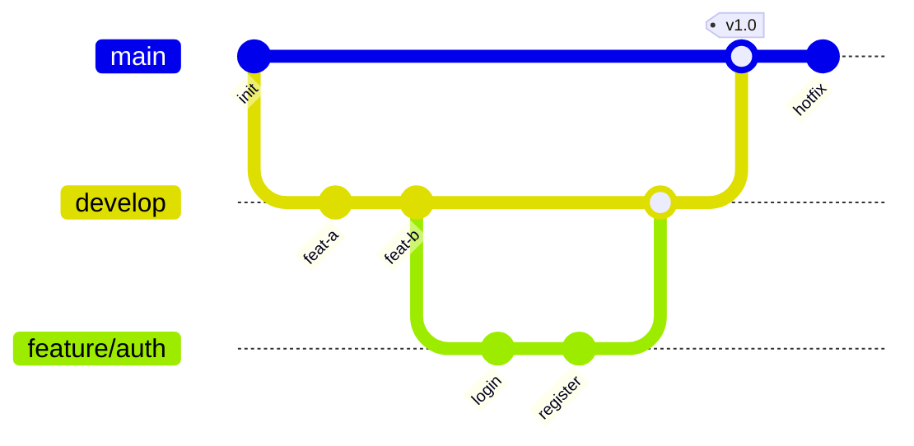

### Syntax Guide

**Commands:** `commit`, `branch`, `checkout`, `merge`, `cherry-pick`

**Tags:** `commit tag: "v1.0"`

---

## 9. Mindmap

**Best for:** Brainstorming, knowledge organization, hierarchical ideas.

### Example: Web Development Stack

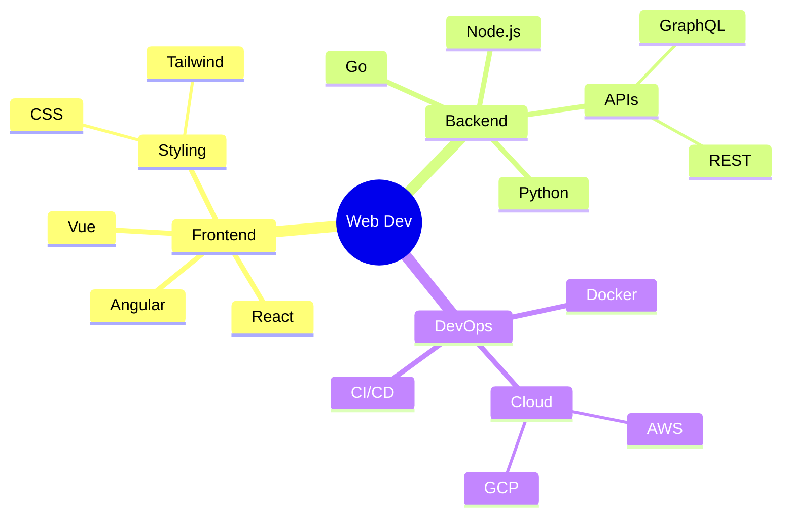

---

## 10. Pie Chart

**Best for:** Showing percentages, data distribution.

### Example: Budget Allocation

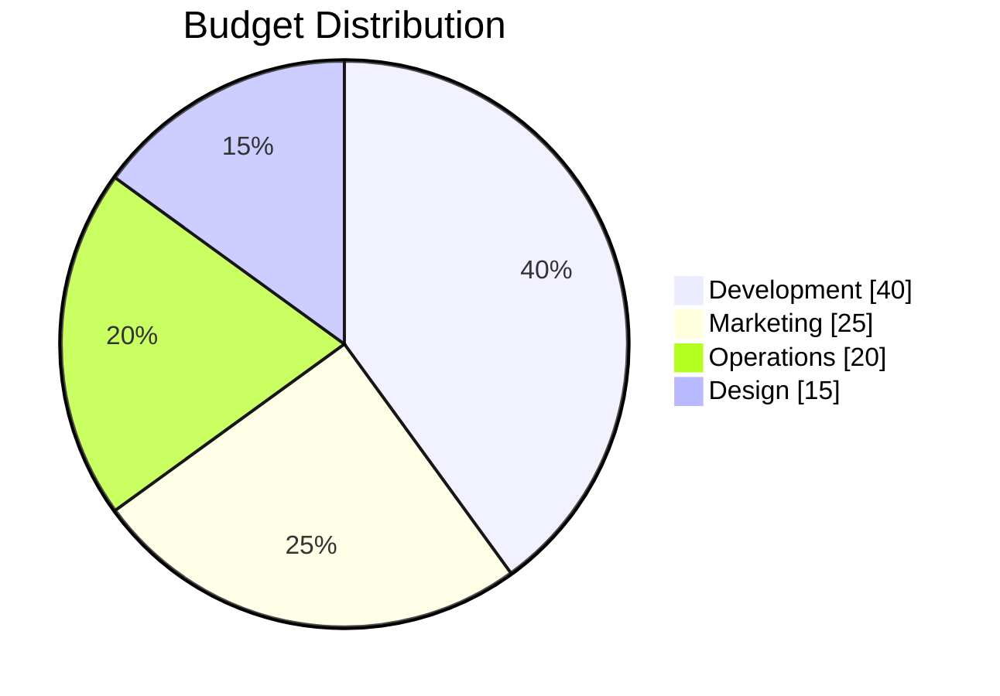

### Syntax Guide

`pie showData title "Title"` - Shows values on chart

---

## 11. Timeline

**Best for:** Chronological events, product roadmaps, history.

### Example: Product Roadmap

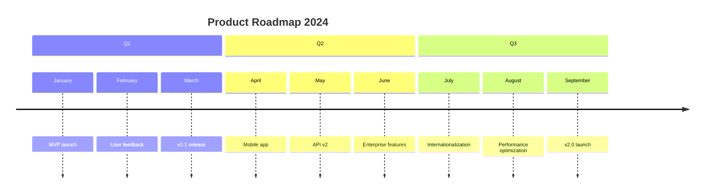

---

## 12. Kanban Board

**Best for:** Agile task management, sprint boards.

### Example: Sprint Board

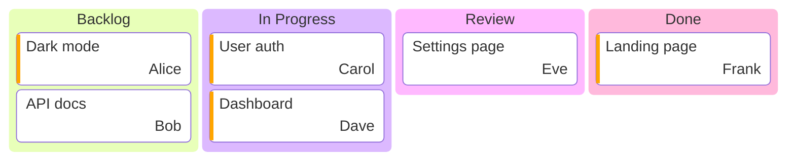

### Syntax Guide

**Metadata:** `@{ assigned: 'name', priority: 'High' }`

---

## 13. Quadrant Chart

**Best for:** Feature prioritization, strategic analysis, 2x2 matrices.

### Example: Feature Priority Matrix

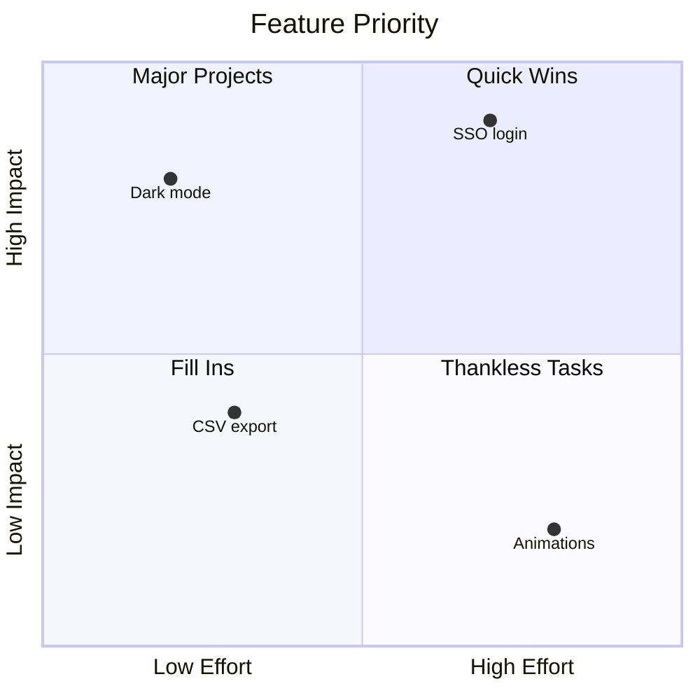

### Syntax Guide

**Coordinates:** Range from 0.0 to 1.0 for both x and y

---

## 14. Sankey Diagram

**Best for:** Flow quantities, conversion funnels, budget allocation.

### Example: User Conversion Funnel

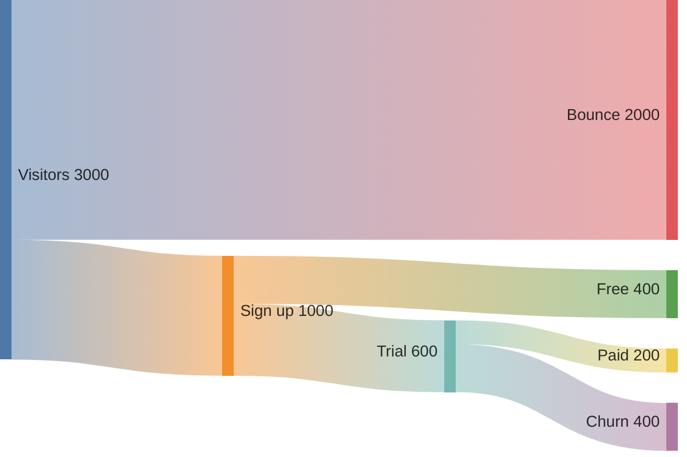

---

## 15. XY Chart

**Best for:** Bar charts, line charts with numerical data.

### Example: Monthly Revenue

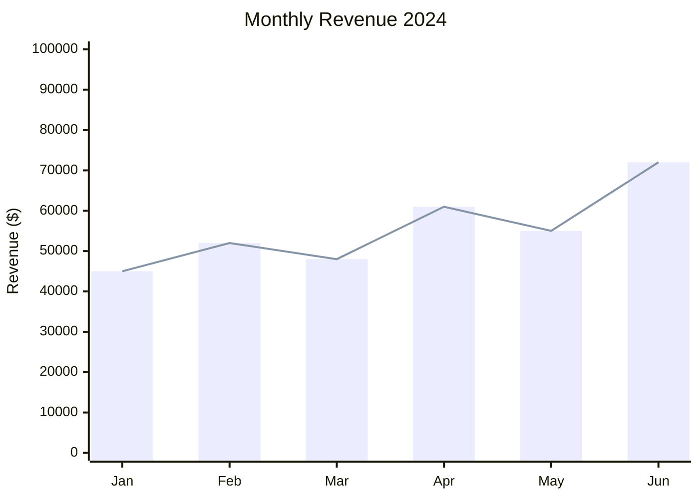

### Syntax Guide

**Types:** `bar` (bar chart), `line` (line chart)

---

## 16. Block Diagram

**Best for:** Custom layouts, grid-style arrangements.

### Example: System Architecture

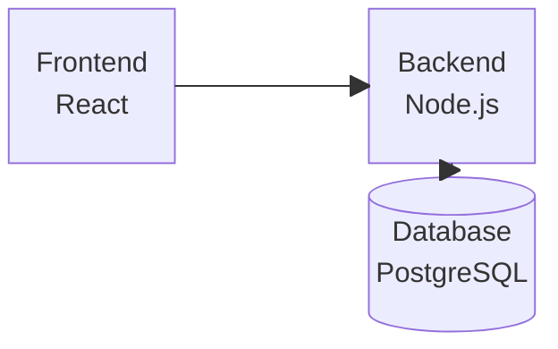

### Syntax Guide

**Layout:** `columns N` defines grid width

**Spanning:** `Block:2` spans 2 columns

---

## 17. Architecture Diagram

**Best for:** Cloud architecture, infrastructure topology.

### Example: AWS Infrastructure

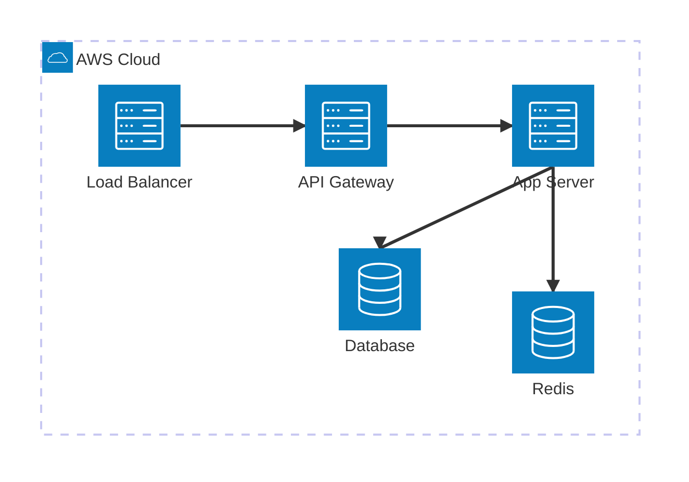

### Syntax Guide

**Icons:** `server`, `database`, `disk`, `cloud`

**Directions:** `L` (left), `R` (right), `T` (top), `B` (bottom)

---

## 18. Packet Diagram

**Best for:** Network packet structures, protocol headers.

### Example: IPv4 Header

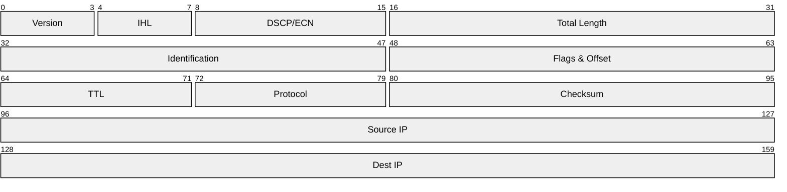

### Syntax Guide

**Format:** `start-end: "Field name"`

---

## 19. Requirement Diagram

**Best for:** Requirements traceability, systems engineering.

### Example: System Requirements

```mermaid
requirementDiagram

requirement uptime_req {
    id: 1
    text: System uptime must be 99.9 percent
    risk: high
    verifymethod: analysis
}

FunctionalRequirement auth_req {
    id: 2
    text: Users must authenticate before accessing data
    risk: high
    verifymethod: test
}

PerformanceRequirement perf_req {
    id: 3
    text: Page load under 200ms
    risk: medium
    verifymethod: test
}

element auth_service {
    type: service
    docref: "auth-spec.pdf"
}

element perf_monitor {
    type: "unit test"
    docref: "LoadTest.cs"
}

auth_service - satisfies -> auth_req
perf_monitor - verifies -> perf_req
auth_req - traces -> uptime_req
```

### Syntax Guide

**Types:** `requirement`, `FunctionalRequirement`, `PerformanceRequirement`

**Risk:** `low`, `medium`, `high`

**Verify method:** `test`, `analysis`, `inspection`, `demonstration`

---

## Quick Reference: Choosing the Right Diagram

| Need                            | Use                  |
| ------------------------------- | -------------------- |
| Process flow, workflow          | `flowchart`          |
| API documentation, message flow | `sequenceDiagram`    |
| Database schema                 | `erDiagram`          |
| Class structure, OOP            | `classDiagram`       |
| State machine, lifecycle        | `stateDiagram-v2`    |
| Project timeline                | `gantt`              |
| Git branching strategy          | `gitGraph`           |
| Cloud infrastructure            | `architecture-beta`  |
| Brainstorming, ideas            | `mindmap`            |
| Task board, agile               | `kanban`             |
| Prioritization matrix           | `quadrantChart`      |
| Conversion funnel               | `sankey-beta`        |
| Bar/line charts                 | `xychart-beta`       |
| Percentages                     | `pie`                |
| Chronological events            | `timeline`           |
| User experience                 | `journey`            |
| Network packets                 | `packet-beta`        |
| Requirements                    | `requirementDiagram` |
| Custom layout                   | `block-beta`         |

---

## Tips for Best Results

1. **Use double quotes for labels with spaces**: `A["Label with spaces"]`
2. **Avoid special characters in node IDs**: Use underscores instead of hyphens
3. **Always declare direction in flowcharts**: `flowchart TD` or `flowchart LR`
4. **Keep labels concise**: Long labels make diagrams hard to read
5. **Use emoji for visual cues**: ✅ Success, ❌ Error, ⚠️ Warning
6. **Test in Mermaid Live Editor**: [mermaid.live](https://mermaid.live) for debugging

---

## Configuration

You can add YAML frontmatter to customize diagram appearance:

```mermaid
---
config:
  theme: dark
  look: handDrawn
---
flowchart LR
    A --> B
```

**Themes:** `default`, `dark`, `forest`, `base`, `neutral`

**Looks:** `default`, `handDrawn`, `classic`
