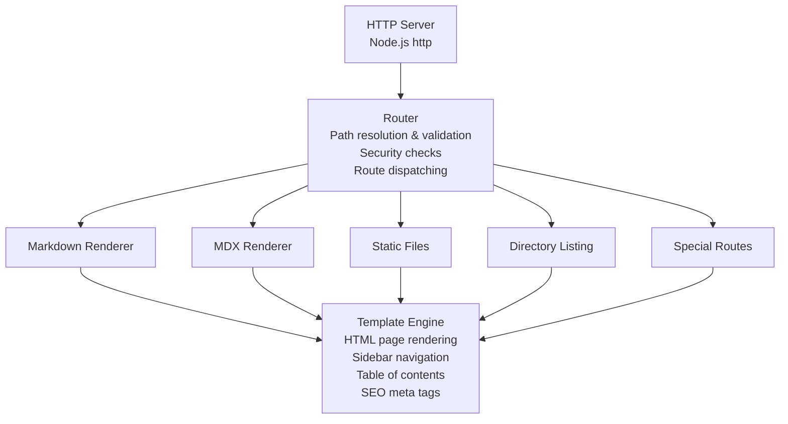
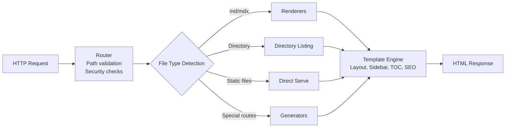
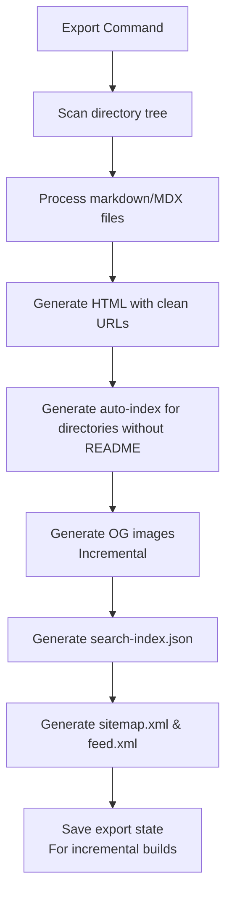

# Architecture

> **Note**: This documentation is intended for contributors to mdsvr, not for end users. If you're looking for user documentation, see the [main docs](..).

## Overview

mdsvr is a zero-configuration documentation server built with Node.js and TypeScript. It transforms a directory of Markdown/MDX files into a full-featured documentation website with no build step required.

## Core Principles

1. **File-based content storage** - No database, all content stored as files
2. **Server-side rendering** - MDX processed server-side, no client-side framework
3. **Zero configuration** - Sensible defaults, optional settings via JSON
4. **Incremental exports** - Smart caching for static HTML generation
5. **Security-first** - Path traversal protection, blocked extensions, read-only

## System Architecture



## Module Structure

### Core Modules

- **`server.ts`** - HTTP server creation, port management, settings hot-reload
- **`router.ts`** - Request routing, path validation, security checks
- **`cli.ts`** - Command-line interface, argument parsing

### Rendering Pipeline

- **`renderer/markdown.ts`** - Markdown to HTML conversion with frontmatter parsing
- **`renderer/mdx.ts`** - MDX to HTML conversion with React component rendering
- **`template/index.ts`** - Full HTML page rendering with layout
- **`template/sidebar.ts`** - Auto-generated sidebar navigation
- **`template/seo.ts`** - Open Graph and Twitter Card meta tags
- **`template/search.ts`** - Client-side search UI

### Configuration

- **`settings/schema.ts`** - Zod schema for settings validation
- **`settings/index.ts`** - Settings loading, validation, and hot-reload
- **`settings/defaults.ts`** - Default configuration values

### Generators

- **`generators/sitemap.ts`** - XML sitemap generation
- **`generators/feed.ts`** - RSS feed generation
- **`generators/search-index.ts`** - Client-side search index builder
- **`generators/static-export.ts`** - Static HTML export with incremental caching

### Open Graph Images

- **`og/generator.ts`** - OG image generation using Satori and Resvg
- **`og/incremental.ts`** - Incremental OG image generation with hash-based caching
- **`og/types.ts`** - OG image data types

### Utilities

- **`directory.ts`** - Directory listing rendering
- **`export-state.ts`** - Export state management for incremental builds
- **`validator/index.ts`** - Markdown validation and auto-fixing

## Data Flow

### Request Flow (Dynamic Server)



### Static Export Flow



## Key Design Decisions

### File-Based Content Storage

Content is stored as plain Markdown/MDX files in the filesystem. No database is used, making the system:

- Simple to deploy (no database setup)
- Easy to version control (Git-friendly)
- Portable (just copy the directory)
- Fast (no database queries)

### Server-Side MDX Rendering

MDX is processed server-side using `@mdx-js/mdx` and React. This means:

- No client-side framework required
- Faster initial page load
- Better SEO (content in HTML)
- Interactive components work without JavaScript

### Zero Configuration

The system works without any configuration file. When `_mdsvr/settings.json` is present:

- Validated against JSON Schema
- Hot-reloaded on changes (no server restart)
- Merges with defaults

### Client-Side Search

Search is implemented client-side using a pre-built `/search-index.json`:

- No external service (Algolia, etc.)
- Fast (pre-indexed)
- Works offline
- Triggered by ⌘K / Ctrl+K

### Incremental Static Export

Static export uses hash-based caching:

- Only regenerates files that changed
- OG images regenerated only when source changes
- Settings changes trigger full rebuild
- State stored in `_mdsvr/export-state.json`

## Security Model

### Path Traversal Protection

Request paths first pass a component-aware lexical containment check. The root
and candidate are then resolved with `realpath`, and the canonical target must
pass the same check before it is read or served:

```typescript
const relativePath = path.relative(rootPath, candidatePath);
if (
  relativePath === ".." ||
  relativePath.startsWith(`..${path.sep}`) ||
  path.isAbsolute(relativePath)
) {
  return 403 Forbidden;
}
```

### Hidden Files

Files starting with `_` or matching patterns in `settings.files.extensions.hidden` are not served.

### Blocked Extensions

Sensitive extensions (`.env`, `.key`, `.pem`, etc.) are blocked by default via `settings.files.extensions.block`.

### Read-Only Operation

The server only reads files - no write operations are exposed through the HTTP API.

## Performance Characteristics

- **Startup time**: ~150ms (no build step)
- **Memory usage**: Low (content loaded on-demand)
- **Static export**: Incremental (only changed files)
- **Search**: Client-side with pre-built index

## Extension Points

The system can be extended through:

- Custom MDX components (via settings)
- Custom themes (via CSS variables)
- Custom static folders (via `settings.files.staticFolders`)
- Custom index files (via `settings.files.indexFiles`)
