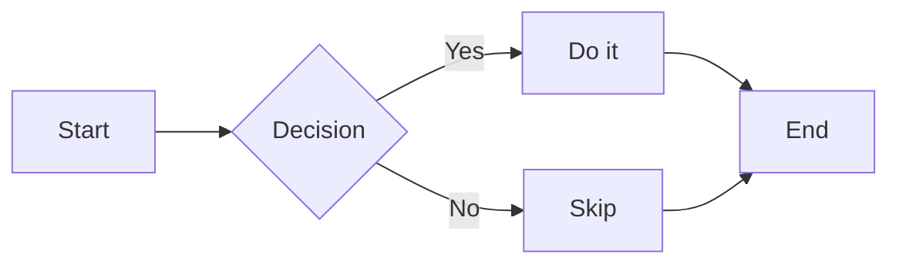
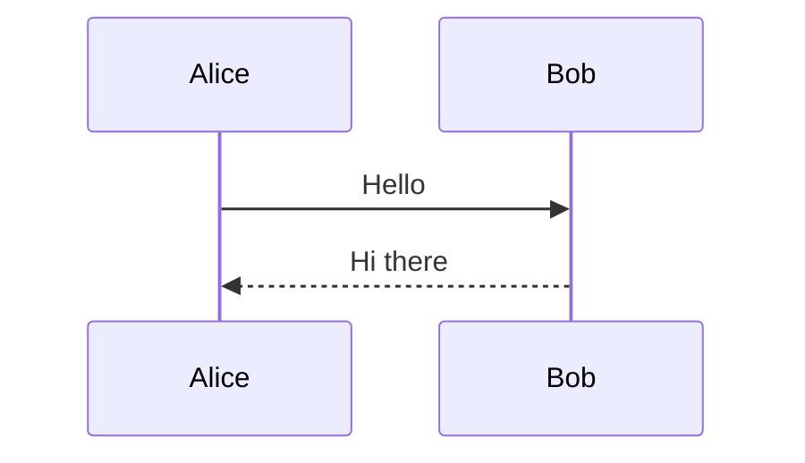
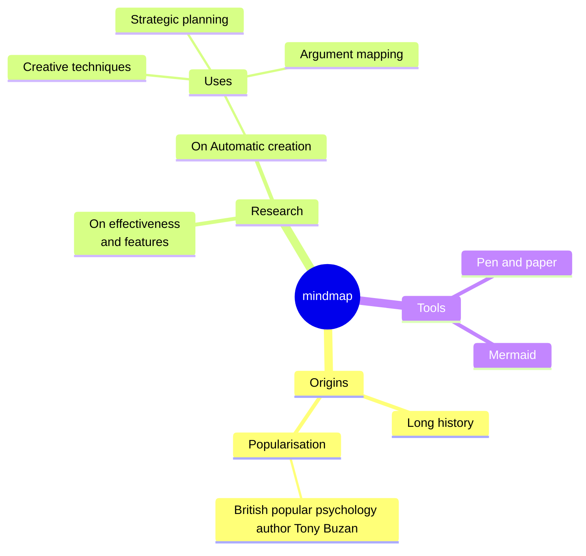
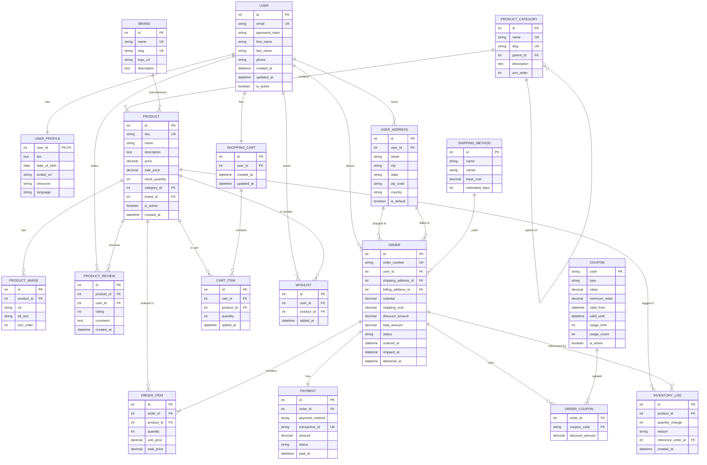

# Mermaid Test

Learn more about Mermaid at [mermaid.js.org](https://mermaid.js.org/)

## Flowchart

## Sequence Diagram

## Mindmap

### Giant E-Commerce Database Schema

See more examples at [mermaid.js.org](https://mermaid.js.org/examples/index.html)
