# Mermaid Diagram Syntax Reference

> Source: https://mermaid.js.org/intro/ | Version: Mermaid v11+
> Used as reference documentation for the Mermaid diagram generation skill.

---

## Overview

All Mermaid diagrams start with a **diagram type declaration keyword**, followed by the content.

```
[keyword]
    [diagram content]
```

Comment: use `%%` to ignore the rest of the line.

---

## Complete List of Diagram Types

| #   | Declaration Keyword         | Diagram Name                |
| --- | --------------------------- | --------------------------- |
| 1   | `flowchart TD` / `graph TD` | Flowchart                   |
| 2   | `sequenceDiagram`           | Sequence Diagram            |
| 3   | `classDiagram`              | Class Diagram               |
| 4   | `stateDiagram-v2`           | State Diagram               |
| 5   | `erDiagram`                 | Entity Relationship Diagram |
| 6   | `gantt`                     | Gantt Chart                 |
| 7   | `journey`                   | User Journey Map            |
| 8   | `gitGraph`                  | Git Graph                   |
| 9   | `mindmap`                   | Mindmap                     |
| 10  | `pie`                       | Pie Chart                   |
| 11  | `timeline`                  | Timeline                    |
| 12  | `kanban`                    | Kanban Board                |
| 13  | `quadrantChart`             | Quadrant Chart              |
| 14  | `sankey-beta`               | Sankey Diagram              |
| 15  | `xychart-beta`              | XY Chart                    |
| 16  | `block-beta`                | Block Diagram               |
| 17  | `architecture-beta`         | Architecture Diagram        |
| 18  | `packet-beta`               | Packet Diagram              |
| 19  | `requirementDiagram`        | Requirement Diagram         |

---

## 1. Flowchart (`flowchart` / `graph`)

**Use when:** Drawing process flows, workflows, decision trees, algorithms.

### Direction (must be declared)

```
TD  = Top to Down
LR  = Left to Right
BT  = Bottom to Top
RL  = Right to Left
```

### Node shapes

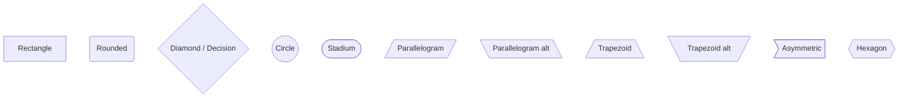
```mermaid
flowchart TD
    A["Rectangle"]
    B("Rounded")
    C{"Diamond / Decision"}
    D(("Circle"))
    E(["Stadium"])
    F[/"Parallelogram"/]
    G[\"Parallelogram alt"\]
    H[/"Trapezoid"\]
    I[\"Trapezoid alt"/]
    J>"Asymmetric"]
    K{{"Hexagon"}}
```

### Edges (arrows)

```
-->        Arrow
---        Line (no arrow)
-.->       Dotted arrow
==>        Thick arrow
--o        Circle edge
--x        Cross edge
<-->       Bidirectional
--|text|-> Arrow with label
```

### Complete example

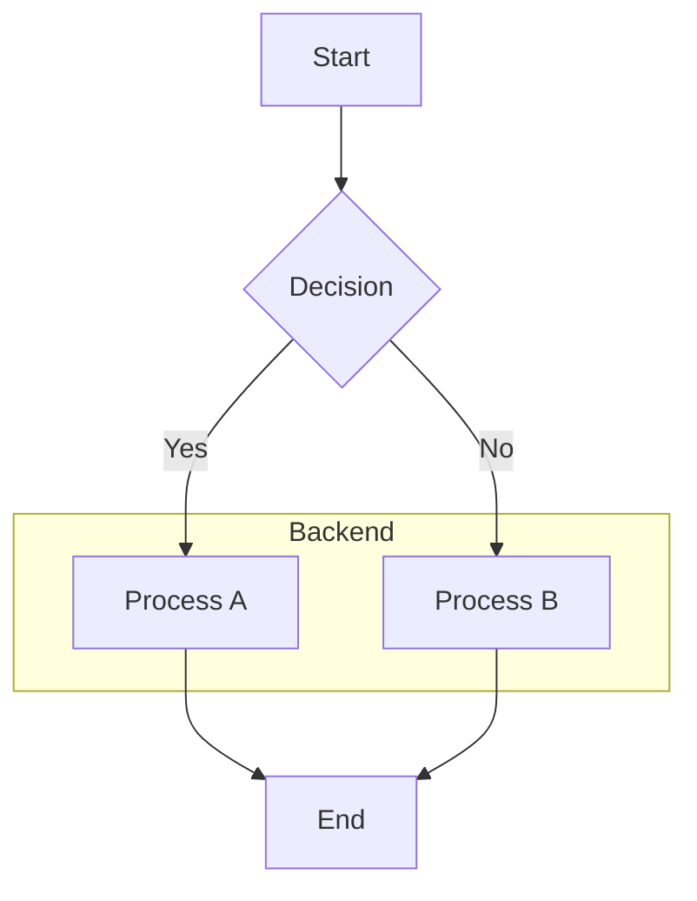
```mermaid
flowchart TD
    A["Start"] --> B{"Decision"}
    B -->|"Yes"| C["Process A"]
    B -->|"No"| D["Process B"]
    C --> E["End"]
    D --> E

    subgraph backend["Backend"]
        C
        D
    end
```

### Important notes

- Do not use lowercase `end` as a node ID (use `End` or `END`)
- Do not use `o` or `x` as the first character in a node ID connected with `---`
- Subgraph must have an explicit ID: `subgraph myid["Label"]`

---

## 2. Sequence Diagram (`sequenceDiagram`)

**Use when:** Describing interactions between actors/systems over time. API docs, auth flow.

### Participant declaration

```
participant A as "Alias Name"
actor User
```

### Arrow types

```
->>     Solid arrow (request)
-->>    Dashed arrow (response)
->>+    Activate participant
-->>-   Deactivate participant
-)      Async arrow
--)     Async dashed
```

### Blocks

```
loop Every minute
    ...
end

alt Success
    ...
else Error
    ...
end

opt Optional
    ...
end

par Parallel
    ...
and
    ...
end

critical Section
    ...
option
    ...
end
```

### Note

```
Note right of Alice: Text here
Note over Alice,Bob: Shared note
```

### Complete example

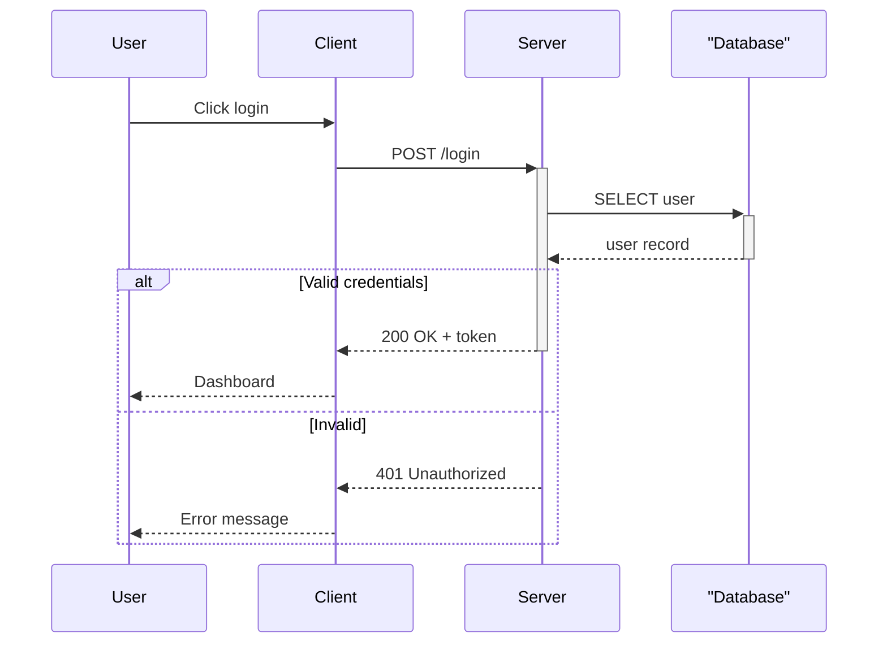
```mermaid
sequenceDiagram
    participant User
    participant Client
    participant Server
    participant DB as "Database"

    User->>Client: Click login
    Client->>+Server: POST /login
    Server->>+DB: SELECT user
    DB-->>-Server: user record
    alt Valid credentials
        Server-->>-Client: 200 OK + token
        Client-->>User: Dashboard
    else Invalid
        Server-->>Client: 401 Unauthorized
        Client-->>User: Error message
    end
```

---

## 3. Class Diagram (`classDiagram`)

**Use when:** Describing OOP structure, software architecture, data models.

### Visibility modifiers

```
+   public
-   private
#   protected
~   package/internal
```

### Relationships

```
<|--    Inheritance (extends)
*--     Composition
o--     Aggregation
-->     Association
--      Link
..>     Dependency
..|>    Realization (implements)
```

### Cardinality

```
"1"     Exactly one
"0..1"  Zero or one
"*"     Many
"1..*"  One or more
```

### Complete example

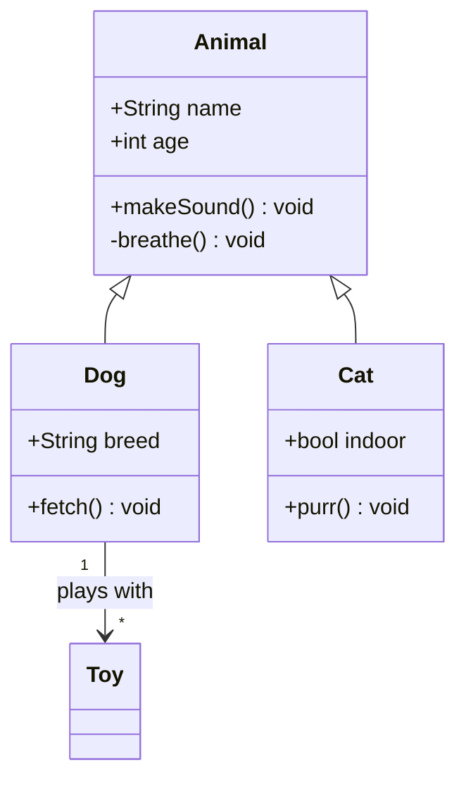
```mermaid
classDiagram
    class Animal {
        +String name
        +int age
        +makeSound() void
        -breathe() void
    }

    class Dog {
        +String breed
        +fetch() void
    }

    class Cat {
        +bool indoor
        +purr() void
    }

    Animal <|-- Dog
    Animal <|-- Cat
    Dog "1" --> "*" Toy : plays with
```

---

## 4. State Diagram (`stateDiagram-v2`)

**Use when:** Describing state machines, lifecycles, object/process states.

### Basic syntax

```
[*]         Start / End state
StateA --> StateB : event label
```

### Composite state

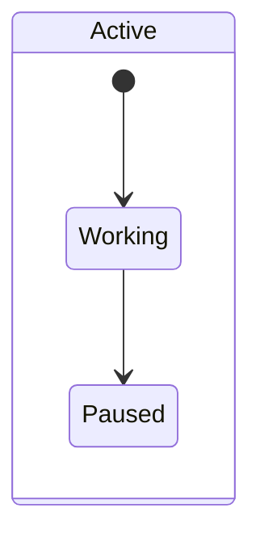
```mermaid
stateDiagram-v2
    state Active {
        [*] --> Working
        Working --> Paused
    }
```

### Concurrency (parallel)

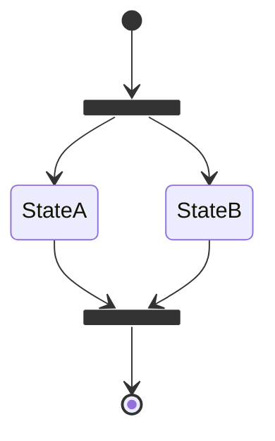
```mermaid
stateDiagram-v2
    state Fork <<fork>>
    state Join <<join>>
    [*] --> Fork
    Fork --> StateA
    Fork --> StateB
    StateA --> Join
    StateB --> Join
    Join --> [*]
```

### Complete example

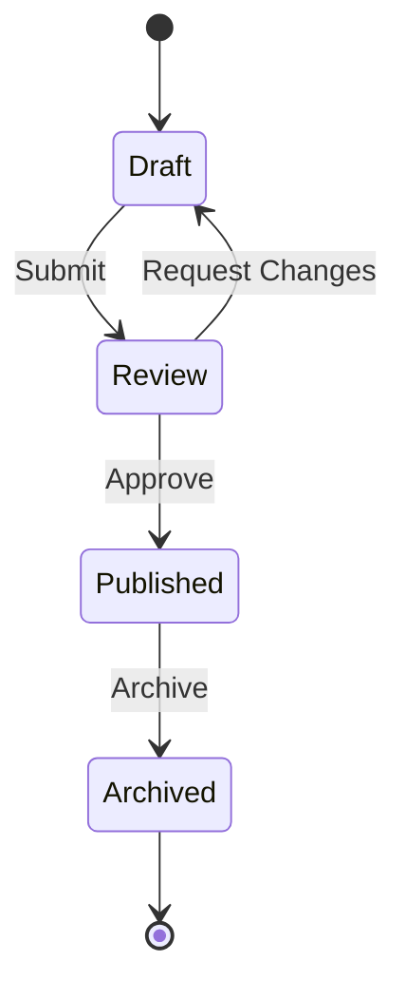
```mermaid
stateDiagram-v2
    [*] --> Draft
    Draft --> Review : Submit
    Review --> Published : Approve
    Review --> Draft : Request Changes
    Published --> Archived : Archive
    Archived --> [*]
```

---

## 5. ER Diagram (`erDiagram`)

**Use when:** Designing database schemas, data modeling.

### Relationship syntax

```
||--||    Exactly one to exactly one
||--o{    Exactly one to zero or more
}o--o{    Zero or more to zero or more
||--|{    Exactly one to one or more
```

### Attribute types

```
int, string, float, boolean, date, datetime, enum
PK  = Primary Key
FK  = Foreign Key
UK  = Unique Key
```

### Complete example

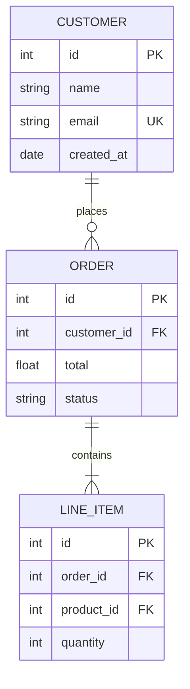
```mermaid
erDiagram
    CUSTOMER {
        int id PK
        string name
        string email UK
        date created_at
    }

    ORDER {
        int id PK
        int customer_id FK
        float total
        string status
    }

    LINE_ITEM {
        int id PK
        int order_id FK
        int product_id FK
        int quantity
    }

    CUSTOMER ||--o{ ORDER : places
    ORDER ||--|{ LINE_ITEM : contains
```

---

## 6. Gantt Chart (`gantt`)

**Use when:** Project planning, scheduling, project timeline management.

### Syntax

```
dateFormat YYYY-MM-DD
axisFormat %m/%d
excludes weekends

section Phase Name
    Task Name :status, id, start_date, duration
```

### Task status

```
done        Completed
active      In progress
crit        Critical path
milestone   Milestone marker (m, milestone, ...)
```

### Duration formats

```
10d     10 days
2w      2 weeks
after id    After another task
```

### Complete example

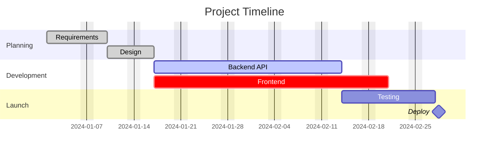
```mermaid
gantt
    title Project Timeline
    dateFormat YYYY-MM-DD
    excludes weekends

    section Planning
        Requirements :done, req, 2024-01-01, 7d
        Design :done, des, after req, 5d

    section Development
        Backend API :active, api, after des, 20d
        Frontend :crit, fe, after des, 25d

    section Launch
        Testing :test, after api, 10d
        Deploy :milestone, after test, 1d
```

---

## 7. User Journey (`journey`)

**Use when:** UX design, customer journey mapping, experience mapping.

### Syntax

```
title Journey Title
section Section Name
    Step Name: score(1-5): Actor1, Actor2
```

Score: 1 (very bad) → 5 (very good)

### Complete example

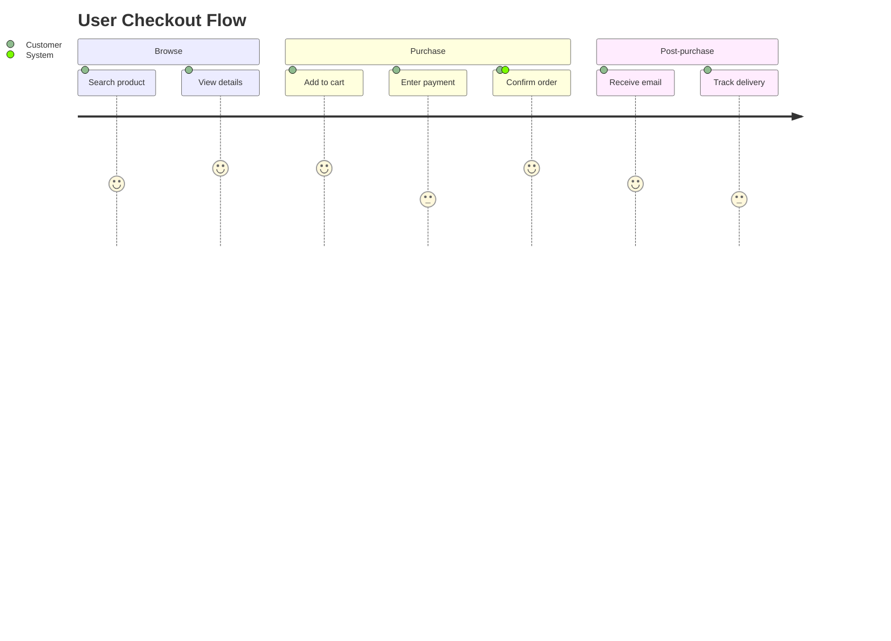
```mermaid
journey
    title User Checkout Flow
    section Browse
        Search product: 4: Customer
        View details: 5: Customer
    section Purchase
        Add to cart: 5: Customer
        Enter payment: 3: Customer
        Confirm order: 5: Customer, System
    section Post-purchase
        Receive email: 4: Customer
        Track delivery: 3: Customer
```

---

## 8. Git Graph (`gitGraph`)

**Use when:** Visualizing Git branching strategies, commit history, release workflows.

### Syntax

```
commit              Create a commit
commit id: "name"   Commit with custom ID
commit tag: "v1.0"  Commit with tag
branch name         Create branch
checkout name       Switch to branch
merge name          Merge branch
cherry-pick id: "x" Cherry-pick commit
```

### Complete example

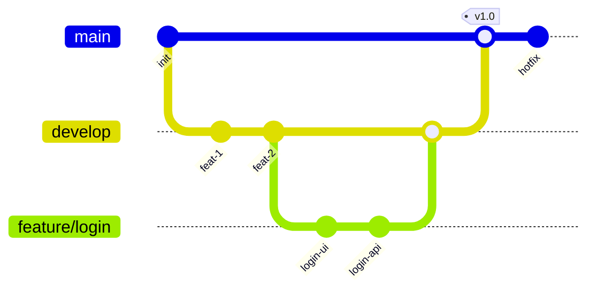
```mermaid
gitGraph
    commit id: "init"
    branch develop
    commit id: "feat-1"
    commit id: "feat-2"
    branch feature/login
    commit id: "login-ui"
    commit id: "login-api"
    checkout develop
    merge feature/login
    checkout main
    merge develop tag: "v1.0"
    commit id: "hotfix"
```

---

## 9. Mindmap (`mindmap`)

**Use when:** Brainstorming, knowledge mapping, hierarchical ideas.

### Node shapes (use indentation to determine level)

```
root((text))    Circle
[text]          Square
(text)          Rounded
))text((        Cloud/Bang
{{text}}        Hexagon
```

### Icons (Font Awesome)

```
::icon(fa fa-book)
::icon(fa fa-gear)
```

### Complete example

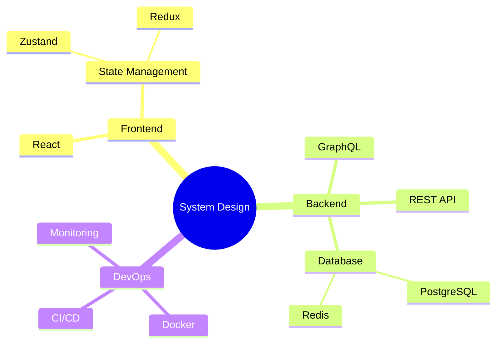
```mermaid
mindmap
  root((System Design))
    Frontend
      React
      State Management
        Redux
        Zustand
    Backend
      REST API
      GraphQL
      Database
        PostgreSQL
        Redis
    DevOps
      Docker
      CI/CD
      Monitoring
```

---

## 10. Pie Chart (`pie`)

**Use when:** Displaying percentages, data distribution.

### Syntax

```
pie title Chart Title
pie showData title Chart Title   (show data)
    "Label" : value
```

### Complete example

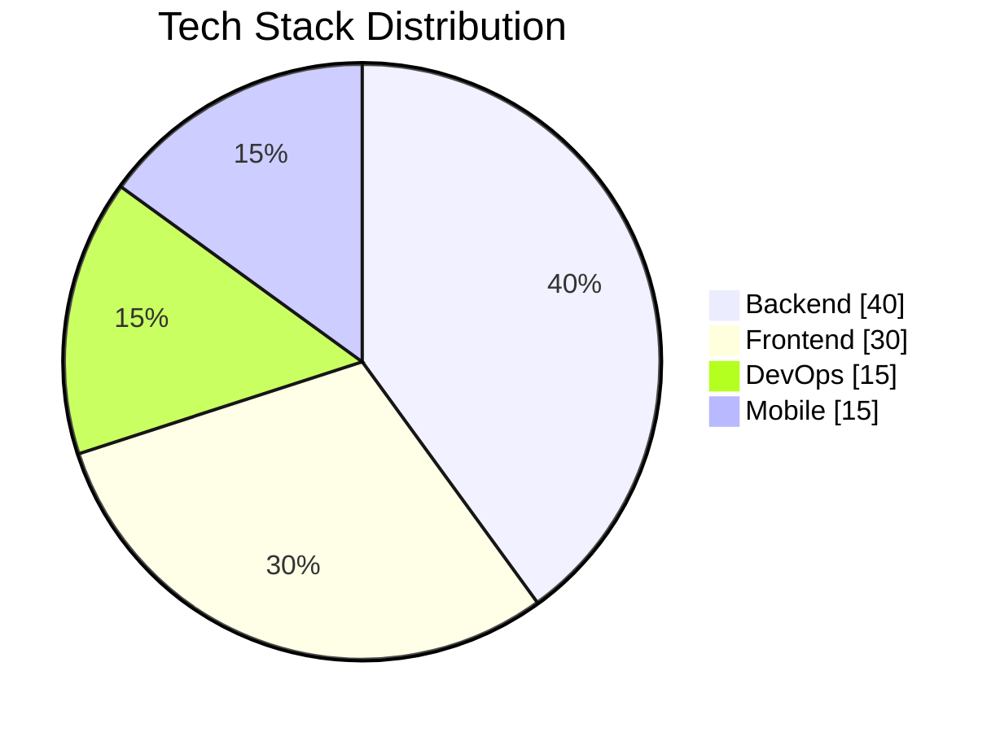
```mermaid
pie showData title Tech Stack Distribution
    "Backend" : 40
    "Frontend" : 30
    "DevOps" : 15
    "Mobile" : 15
```

---

## 11. Timeline (`timeline`)

**Use when:** Chronological events, product roadmaps, milestone history.

### Syntax

```
timeline
    title Timeline Title
    section Period
        Time : Event 1
             : Event 2
```

### Complete example

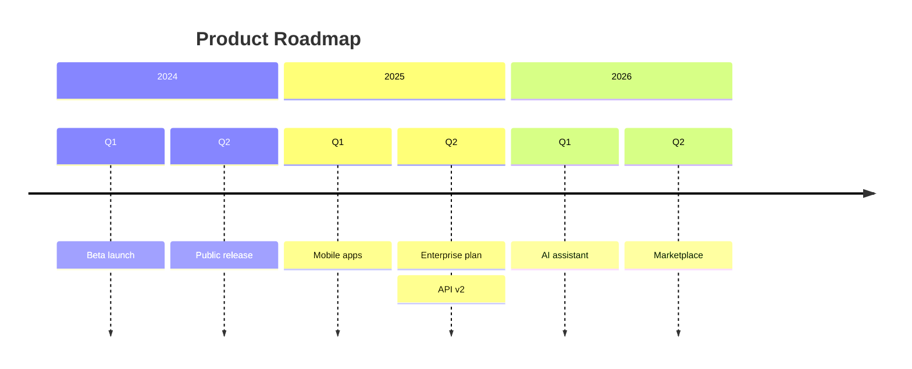
```mermaid
timeline
    title Product Roadmap
    section 2024
        Q1 : Beta launch
        Q2 : Public release
    section 2025
        Q1 : Mobile apps
        Q2 : Enterprise plan
           : API v2
    section 2026
        Q1 : AI assistant
        Q2 : Marketplace
```

---

## 12. Kanban (`kanban`)

**Use when:** Agile task management, sprint boards, workflow visualization.

### Syntax

```
kanban
  Column Name
    Task Name
    [Task with brackets]@{ assigned: 'name', priority: 'High' }
```

### Metadata fields

```
assigned    Assignee
priority    High / Medium / Low
ticket      Ticket number
```

### Complete example

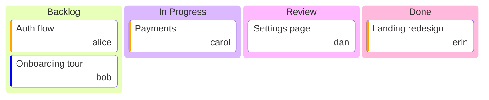
```mermaid
kanban
  Backlog
    [Auth flow]@{ assigned: 'alice', priority: 'High' }
    [Onboarding tour]@{ assigned: 'bob', priority: 'Low' }
  In Progress
    [Payments]@{ assigned: 'carol', priority: 'High' }
  Review
    [Settings page]@{ assigned: 'dan', priority: 'Medium' }
  Done
    [Landing redesign]@{ assigned: 'erin', priority: 'High' }
```

---

## 13. Quadrant Chart (`quadrantChart`)

**Use when:** Feature prioritization, strategic analysis, BCG matrix, 2x2 comparison.

### Syntax

```
quadrantChart
    title Chart Title
    x-axis Low Label --> High Label
    y-axis Low Label --> High Label
    quadrant-1 Top-right label
    quadrant-2 Top-left label
    quadrant-3 Bottom-left label
    quadrant-4 Bottom-right label
    Item Name: [x, y]
```

Coordinates x, y: 0.0 → 1.0

### Complete example

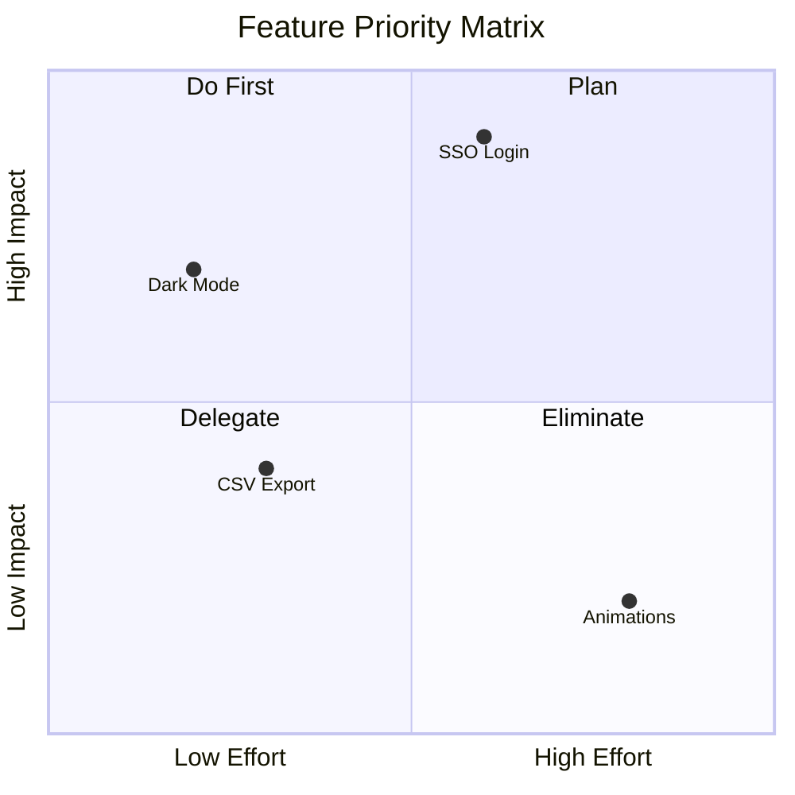
```mermaid
quadrantChart
    title Feature Priority Matrix
    x-axis Low Effort --> High Effort
    y-axis Low Impact --> High Impact
    quadrant-1 Plan
    quadrant-2 Do First
    quadrant-3 Delegate
    quadrant-4 Eliminate
    Dark Mode: [0.2, 0.7]
    SSO Login: [0.6, 0.9]
    CSV Export: [0.3, 0.4]
    Animations: [0.8, 0.2]
```

---

## 14. Sankey Diagram (`sankey-beta`)

**Use when:** Flow quantities, energy flows, budget allocation, conversion funnels.

### Syntax (CSV format)

```
sankey-beta

Source,Target,Value
NodeA,NodeB,amount
NodeA,NodeC,amount
```

### Complete example

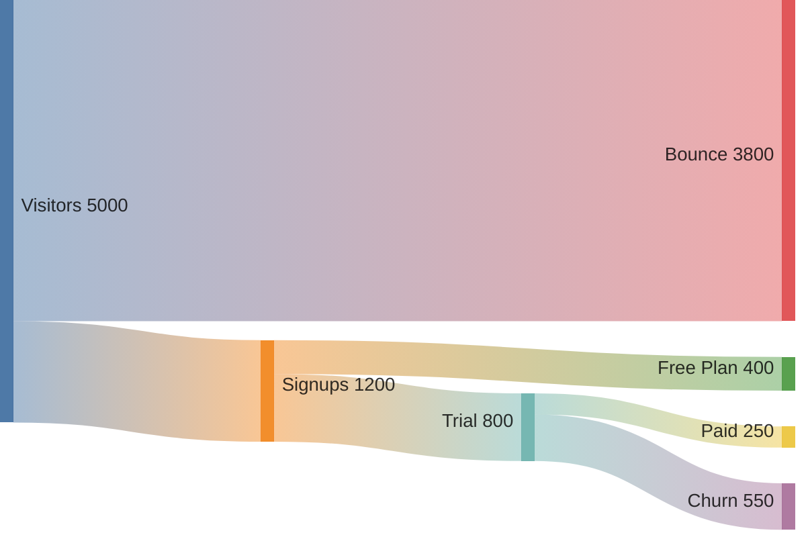
```mermaid
sankey-beta

Visitors,Signups,1200
Visitors,Bounce,3800
Signups,Trial,800
Signups,Free Plan,400
Trial,Paid,250
Trial,Churn,550
```

---

## 15. XY Chart (`xychart-beta`)

**Use when:** Bar charts, line charts with numerical data.

### Syntax

```
xychart-beta
    title "Chart Title"
    x-axis [label1, label2, ...]
    y-axis "Label" min --> max
    bar [v1, v2, ...]
    line [v1, v2, ...]
```

### Complete example

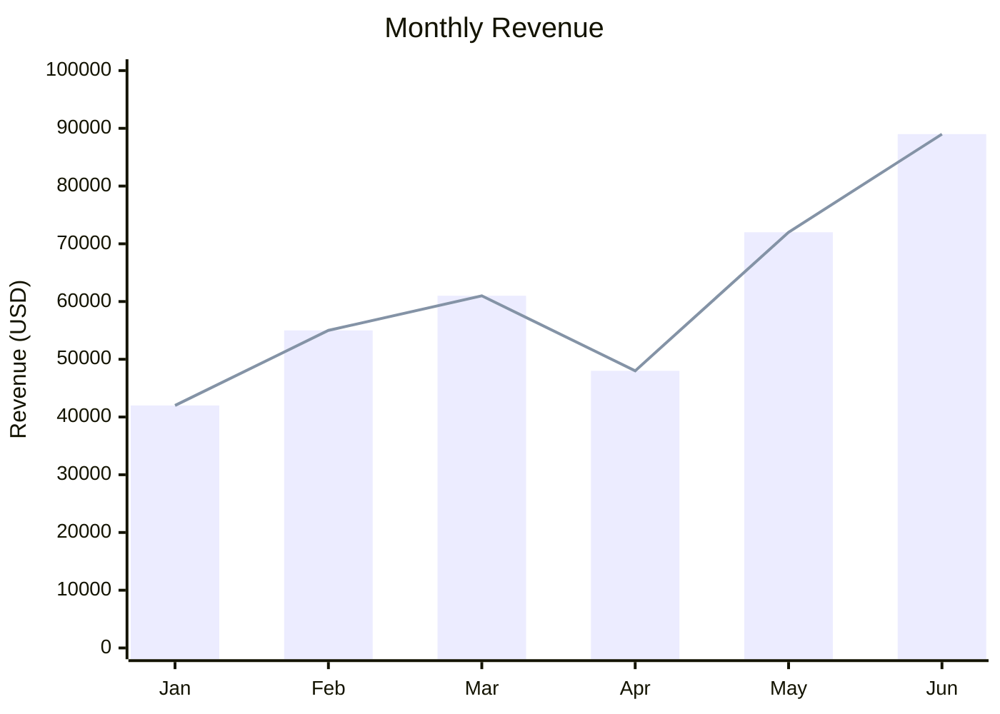
```mermaid
xychart-beta
    title "Monthly Revenue"
    x-axis ["Jan", "Feb", "Mar", "Apr", "May", "Jun"]
    y-axis "Revenue (USD)" 0 --> 100000
    bar [42000, 55000, 61000, 48000, 72000, 89000]
    line [42000, 55000, 61000, 48000, 72000, 89000]
```

---

## 16. Block Diagram (`block-beta`)

**Use when:** Custom layout diagrams, CSS-grid-style block arrangements.

### Syntax

```
block-beta
    columns 3
    A B C
    D:2 E
    blockArrowId<["Label"]>(right)
```

### Complete example

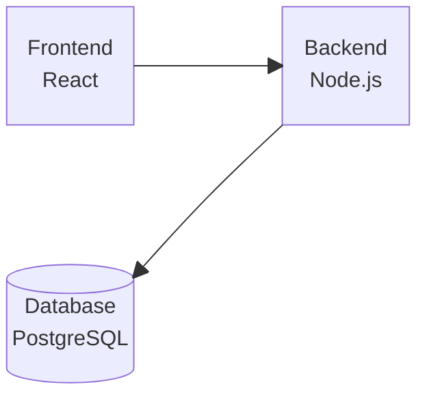
```mermaid
block-beta
    columns 3
    Frontend["Frontend\nReact"]
    space
    Backend["Backend\nNode.js"]
    space:3
    DB[("Database\nPostgreSQL")]

    Frontend --> Backend
    Backend --> DB
```

---

## 17. Architecture Diagram (`architecture-beta`)

**Use when:** Cloud architecture, CI/CD infrastructure, service topology.

### Building blocks

```
group id(icon)[Label]
service id(icon)[Label] in groupId
edge ServiceA:Side --> Side:ServiceB
junction id
```

### Side directions

```
L  Left
R  Right
T  Top
B  Bottom
```

### Complete example

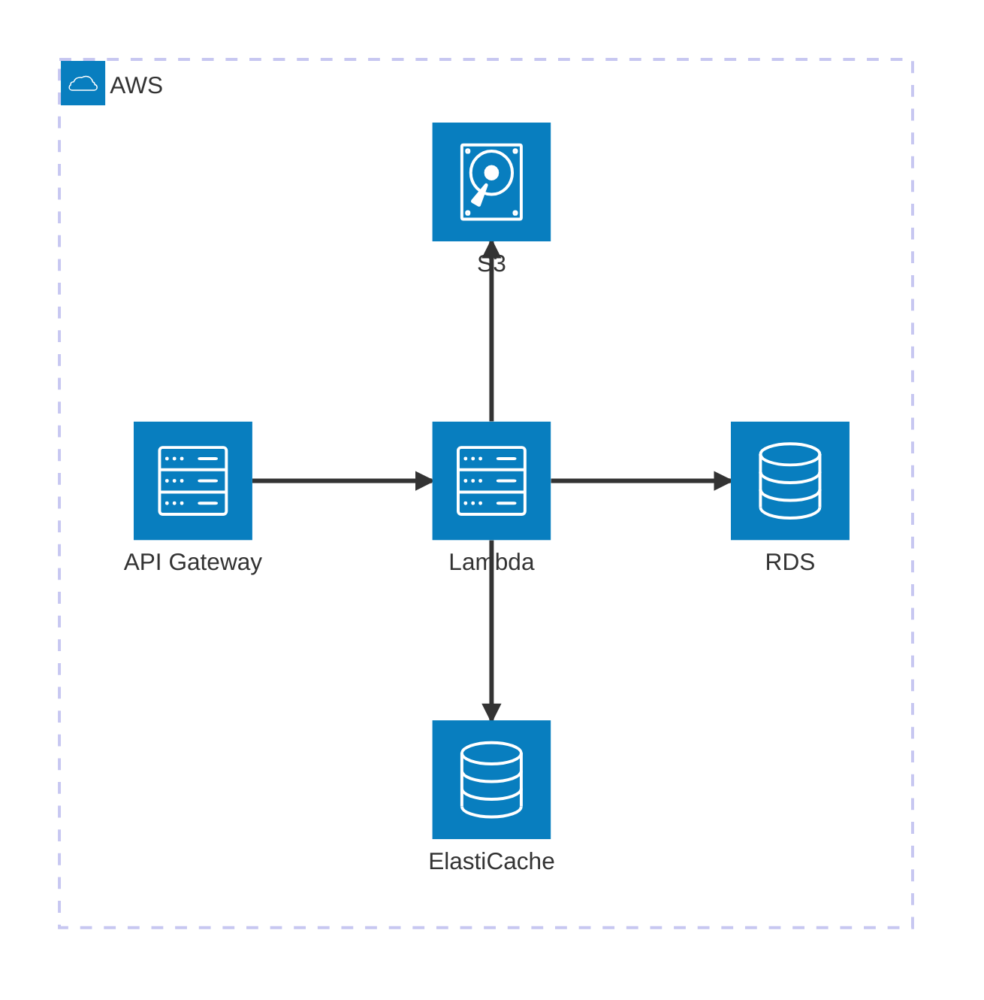
```mermaid
architecture-beta
    group cloud(cloud)[AWS]

    service api(server)[API Gateway] in cloud
    service lambda(server)[Lambda] in cloud
    service db(database)[RDS] in cloud
    service cache(database)[ElastiCache] in cloud
    service s3(disk)[S3] in cloud

    api:R --> L:lambda
    lambda:R --> L:db
    lambda:B --> T:cache
    lambda:T --> B:s3
```

---

## 18. Packet Diagram (`packet-beta`)

**Use when:** Network packet structures, protocol headers, binary data formats.

### Syntax

```
packet-beta
    0-7: "Field Name"
    8-15: "Field Name"
    16-31: "Field Name (spanning)"
```

### Complete example

```mermaid
packet-beta
    0-3: "Version"
    4-7: "IHL"
    8-15: "DSCP/ECN"
    16-31: "Total Length"
    32-47: "Identification"
    48-50: "Flags"
    51-63: "Fragment Offset"
    64-71: "TTL"
    72-79: "Protocol"
    80-95: "Header Checksum"
    96-127: "Source IP"
    128-159: "Destination IP"
```

---

## 19. Requirement Diagram (`requirementDiagram`)

**Use when:** Systems engineering, requirements traceability, spec documentation.

### Requirement types (replaces `requirement`)

```
requirement
FunctionalRequirement
InterfaceRequirement
PerformanceRequirement
PhysicalRequirement
DesignConstraint
```

> ⚠️ Types other than `requirement` use **PascalCase** (capitalize first letter of each word). Fields inside the block (`id`, `text`, `risk`, `verifymethod`) remain lowercase.

### Risk values

```
low | medium | high
```

### Verifymethod values

```
test | inspection | analysis | demonstration
```

### Relationship types

```
contains | copies | derives | satisfies | verifies | refines | traces
```

### Standard syntax

```
requirementDiagram

<type> name_no_spaces {
    id: 1
    text: plain text description here
    risk: high
    verifymethod: test
}

element elem_name {
    type: user_defined_type
    docref: user_defined_ref
}

name_no_spaces - satisfies -> elem_name
name_no_spaces - traces -> other_req_name
```

### ⚠️ Common errors to avoid

- **Requirement names MUST NOT use `-` or special characters** — use `snake_case` or `camelCase`
- **If the name has special characters (`__`, `-`, space), wrap in `"quotes"`** as shown in the example below
- **`verifymethod`** must be entirely lowercase (not `verifyMethod`)
- **Relationship syntax** must have spaces: `name - satisfies -> elem` (not `name-satisfies->elem`)
- Do not use `REQ-001` as a node name directly in relationships because `-` causes parser errors — keep numbers like that only in the `id:` field
- **`docref` and `type` in `element`**: if the value contains `-`, `.`, or spaces, it **must be wrapped in `"quotes"`** — example: `docref: "auth-spec.pdf"`, `type: "unit test"`

### Simple example (safe)

```mermaid
requirementDiagram

requirement test_req {
    id: 1
    text: the test text
    risk: high
    verifymethod: test
}

element test_entity {
    type: simulation
}

test_entity - satisfies -> test_req
```

### Example with quoted names (when special characters are needed)

```mermaid
requirementDiagram

requirement "__test_req__" {
    id: 1
    text: the test text
    risk: high
    verifymethod: test
}

element test_entity {
    type: simulation
}

test_entity - satisfies -> "__test_req__"
```

### Complete example with multiple types

```mermaid
requirementDiagram

requirement uptime_req {
    id: 1
    text: System uptime must be 99.9 percent
    risk: high
    verifymethod: analysis
}

FunctionalRequirement auth_req {
    id: 2
    text: Users must authenticate before accessing data
    risk: high
    verifymethod: test
}

PerformanceRequirement perf_req {
    id: 3
    text: Page load under 200ms
    risk: medium
    verifymethod: test
}

element auth_service {
    type: service
    docref: "auth-spec.pdf"
}

element perf_monitor {
    type: "unit test"
    docref: "LoadTest.cs"
}

auth_service - satisfies -> auth_req
perf_monitor - verifies -> perf_req
auth_req - traces -> uptime_req
```

---

## Global Config & Frontmatter

You can add YAML frontmatter before the diagram to configure:

```
---
title: "My Diagram"
config:
  theme: dark
  look: handDrawn
  layout: elk
  maxEdges: 100
---
flowchart TD
    A --> B
```

### Theme options

```
default | dark | forest | base | neutral
```

### Look options

```
default | handDrawn | classic
```

### Layout engines

```
dagre (default) | elk (better for complex diagrams)
```

---

## Syntax Safety Rules (apply to all diagrams)

| Rule                        | ❌ Avoid                           | ✅ Use                           |
| --------------------------- | ---------------------------------- | -------------------------------- |
| Node ID                     | `user-service`, `node.api`         | `user_service`, `nodeApi`        |
| Label with spaces           | `A[Order Service]`                 | `A["Order Service"]`             |
| Special chars in label      | `(`, `)`, `{`, `}`, `<`, `>`, `\|` | Use plain text                   |
| Markdown in label           | `A["**bold**"]`                    | `A["bold"]`                      |
| Line break in label         | `A["line\n two"]`                  | `A["line<br />two"]`             |
| Reserved keyword as ID      | `end`, `class`, `graph`            | Rename to `theEnd`, `myClass`    |
| Flowchart without direction | `flowchart`                        | `flowchart TD` or `flowchart LR` |
| Subgraph without ID         | `subgraph Backend`                 | `subgraph backend["Backend"]`    |

---

## Mermaid Generation Requirements (Mandatory rules when creating diagrams)

> Applies to all diagram types, every generation.

### 1. Choose the correct diagram type

Do not default to `flowchart`. Choose the type most appropriate for the content. If multiple types are suitable, briefly explain the reason for your choice.

### 2. Maximize compatibility

Code must render on: GitHub, Mermaid Live Editor, Obsidian, VSCode plugins, common Markdown renderers.

### 3. Node IDs

✅ Use only: letters, numbers, underscores  
❌ Avoid: `-`, `.`, `(`, `)` in IDs

```
✅  user_service  db_01  nodeA
❌  user-service  user.api  node(id)
```

### 4. Node labels

✅ Use `["double quotes"]`  
❌ Do not use `(Single round)` if the label has spaces

```
✅  A["User Service"]
❌  A(User Service)
```

### 5. Escape special characters in labels

Avoid unescaped: `(`, `)`, `[`, `]`, `{`, `}`, `<`, `>`, `|`, `"`, `'`  
Prefer plain text in labels.

### 6. Do not use Markdown formatting in labels

```
❌  A["**API**"]   A["# Header"]
✅  A["API"]
```

### 7. Labels must be concise

```
❌  A["This API service receives requests from authenticated users"]
✅  A["API Service"]
```

### 8. Quote labels with spaces

```
✅  A["Order Service"]
❌  A[Order Service]
```

### 9. Avoid reserved keywords as IDs

Do not use: `end`, `class`, `click`, `style`, `graph`, `subgraph`  
Rename to: `theEnd`, `myClass`, etc.

### 10. Flowchart: always declare direction

```
✅  flowchart TD
✅  flowchart LR
❌  flowchart
```

### 11. Subgraph: always have explicit ID

```
✅  subgraph backend["Backend"]
❌  subgraph Backend
```

### 12. Sequence Diagram: declare participants first

```mermaid
sequenceDiagram
    participant User
    participant API
    participant DB
    %% ... then write messages
```

### 13. ER Diagram: use correct relationship operators

```
✅  USER ||--o{ ORDER : places
❌  USER --> ORDER
```

### 14. Class Diagram: use correct visibility and typing

```
✅  +createUser()   -password   +id: string
```

### 15. State Diagram: use `stateDiagram-v2`

```
✅  stateDiagram-v2
❌  stateDiagram
```

### 16. Line breaks in labels

```
✅  A["Line one<br />Line two"]
❌  A["Line one\nLine two"]
```

### 17. Do not mix syntax between diagram types

`architecture-beta` and `block-beta`: use only official syntax, do not mix with flowchart syntax.

### 18. Styling

❌ Do not use: `style`, `classDef`, `class`, `linkStyle`, `themeVariables`, hardcoded colors — unless explicitly requested by the user  
✅ Use emoji to convey meaning instead of colors (works well on both light and dark modes):

```
✅ Success   ❌ Failure   ⚠️ Warning   🔒 Auth   🔑 Authorization
🚀 Deploy    📦 Package   🗄️ Database  🌐 External  👤 User
🤖 Worker    💾 Storage
```

### 19. Output format

- Output only 1 Mermaid code block unless the user requests multiple
- Code must be syntactically valid
- Double-check characters that cause parser errors before returning
- Prioritize readability over visual complexity
- If the diagram is too complex, split it only when the user requests

---

## When to use which diagram

| Situation                             | Recommended diagram  |
| ------------------------------------- | -------------------- |
| Process flow, workflow, decision      | `flowchart`          |
| API call, auth flow, message exchange | `sequenceDiagram`    |
| Database schema                       | `erDiagram`          |
| OOP / class structure                 | `classDiagram`       |
| State machine, lifecycle              | `stateDiagram-v2`    |
| Project timeline, sprint              | `gantt`              |
| Git branching                         | `gitGraph`           |
| Cloud / infra architecture            | `architecture-beta`  |
| Brainstorm, knowledge map             | `mindmap`            |
| Agile board, task tracking            | `kanban`             |
| Prioritization 2x2                    | `quadrantChart`      |
| Flow quantity, funnel                 | `sankey-beta`        |
| Bar/Line chart                        | `xychart-beta`       |
| Percentage                            | `pie`                |
| Chronological milestones              | `timeline`           |
| User experience                       | `journey`            |
| Network packet structure              | `packet-beta`        |
| Requirements traceability             | `requirementDiagram` |
| Custom block layout                   | `block-beta`         |
